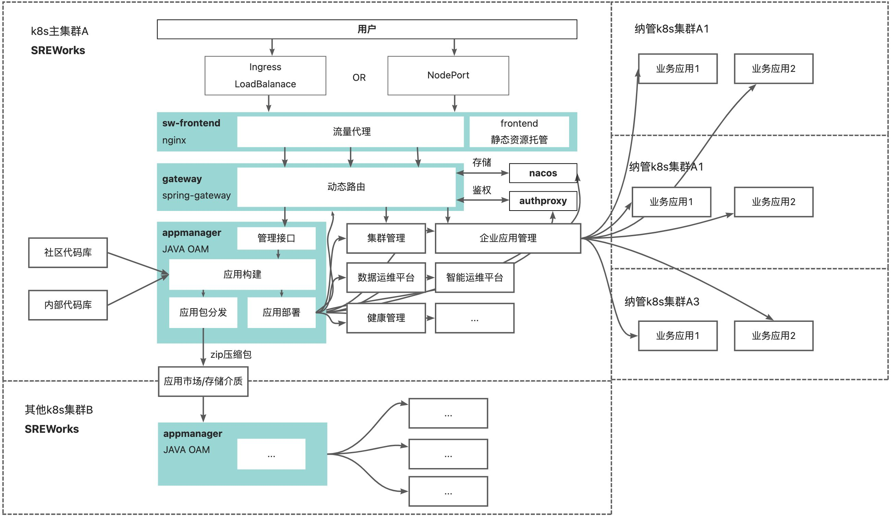

<a name="VDP4m"></a>

### 1. 部署SREWorks的基础条件是什么？
- 您需要一个Kubernetes集群。SREWorks专为云原生下的运维而生，同时SREWorks自身也是基于云原生架构的落地实现。
- SREWorks不支持在非Kubernetes集群的场景部署。

<a name="pyyIT"></a>

### 2. Appmanager运行报错，无法创建新线程
```
java.lang.OutOfMemoryError: unable to create native thread
```
需要将 /var/lib/kubelet/config.yaml 中的 `podPidsLimit: 1000` 改为 `podPidsLimit: -1`
<a name="LYcu3"></a>

### 
<a name="LdEAB"></a>

### 3. SREWorks的架构拓扑是怎么样的？



<a name="AYcoD"></a>

### 4. Skywalking oap-server启动失败，报错table: xxx does not exist. OAP is running in 'no-init' mode, waiting... retry 3s later.
这个是由于Skywalking的TTL失效bug引起，目前最新的9.2.0版本还未修复，但master分支已经修复，具体详情可以先参考[官方issue](https://github.com/apache/skywalking/issues/4938)。如遇这种情况，当前可以先删除相应的index和template，在进行服务重启。
