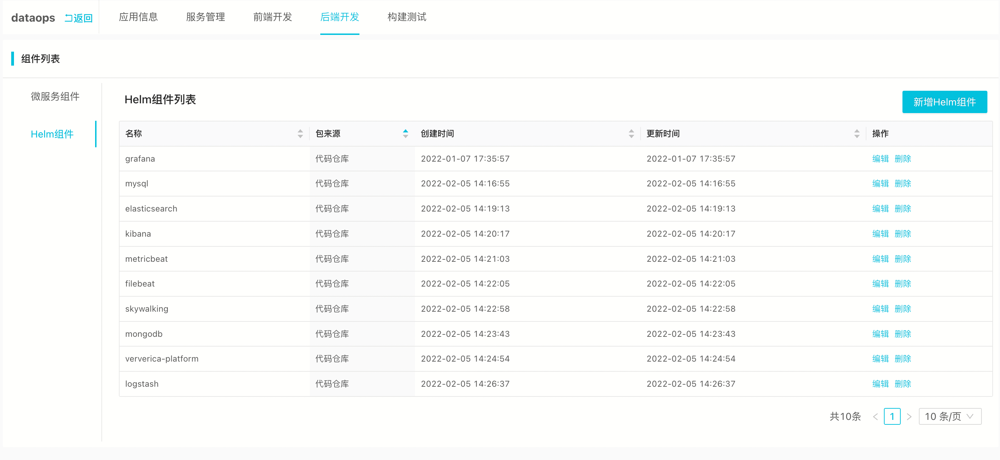
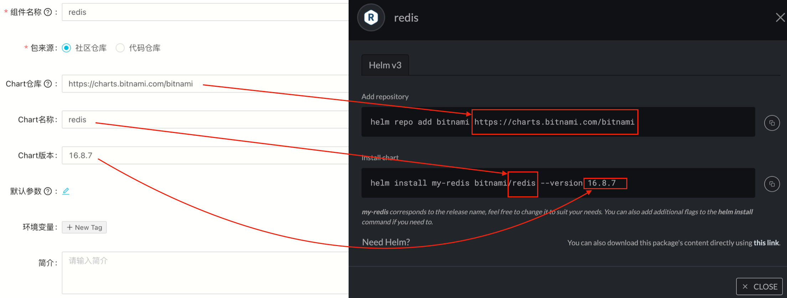

<a name="uxaTe"></a>

### 1. 数据运维平台（dataops）应用默认部署的组件有哪些？
开源版SREWorks中基于流行的业界开源软件构筑了运维数仓及数据采集加工等相关能力，其中以Elasticsearch和vvp（flink的云原生版本）为主。<br />

<a name="biXgt"></a>

### 2. v1.1版本支持数据组件可插拔能力会带来哪些变化？
数据组件可插拔功能即可以给用户带来更大灵活性，也使得SREWorks易用性得到极大提高。新版本将ElasticSearch、MySQL以及MinIO等通过抽取部署变量方式实现组件的可插拔能力。<br />**ElasticSearch**:

   - v1.0版本内置ES默认不开启用户认证，V1.1新版本内置ES实例默认开启内置用户(elastic)认证功能，后续用户在使用ES服务时需要带认证信息访问。
```shell
curl --output /dev/null -u "elastic:${ELASTICSEARCH_PASSWORD}" "http://localhost:9200"
```

   - 内置ES实例，默认安装elasticsearch-analysis-ik分词器，用于站点搜索服务。替换成用户自定义ES实例后，需要手工安装该插件，否则搜索服务无法正常使用，[移步安装指南](https://github.com/medcl/elasticsearch-analysis-ik)
   - 推荐ES实例版本 7.0+

<a name="cB4Be"></a>

### 3. 如何填写组件中的HELM社区仓库

