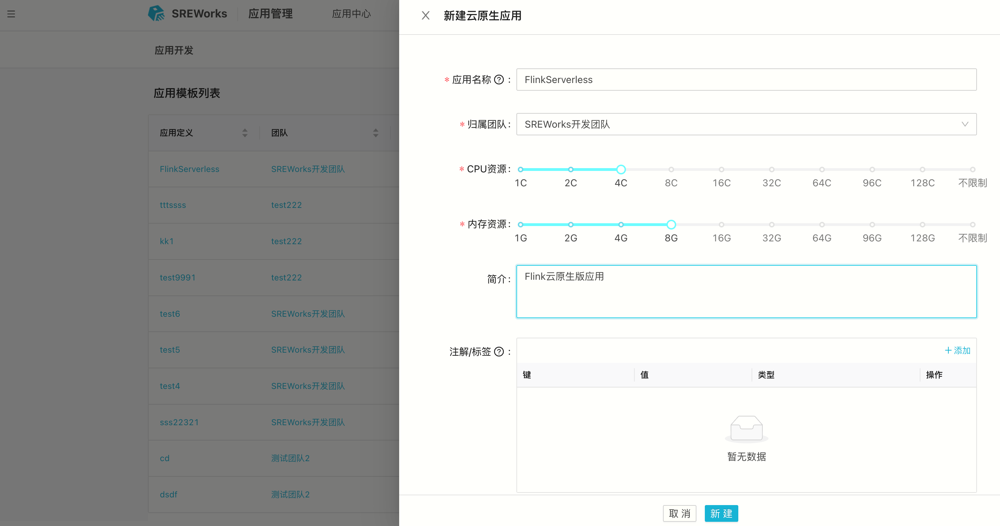
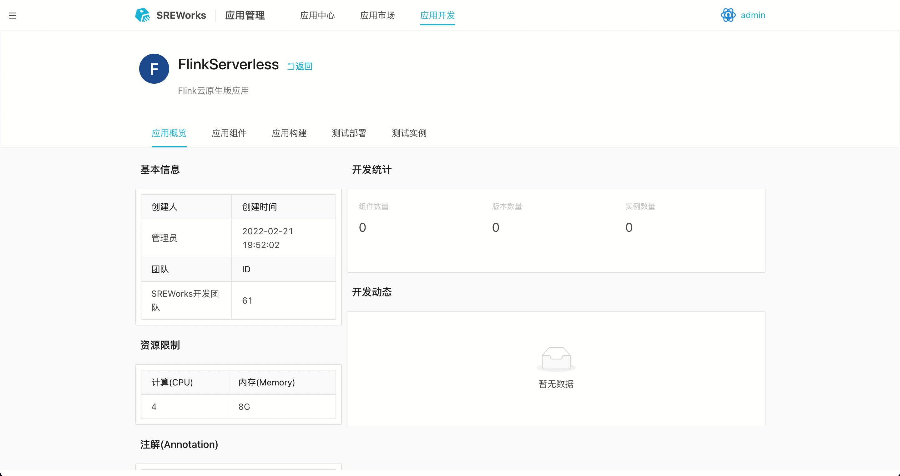
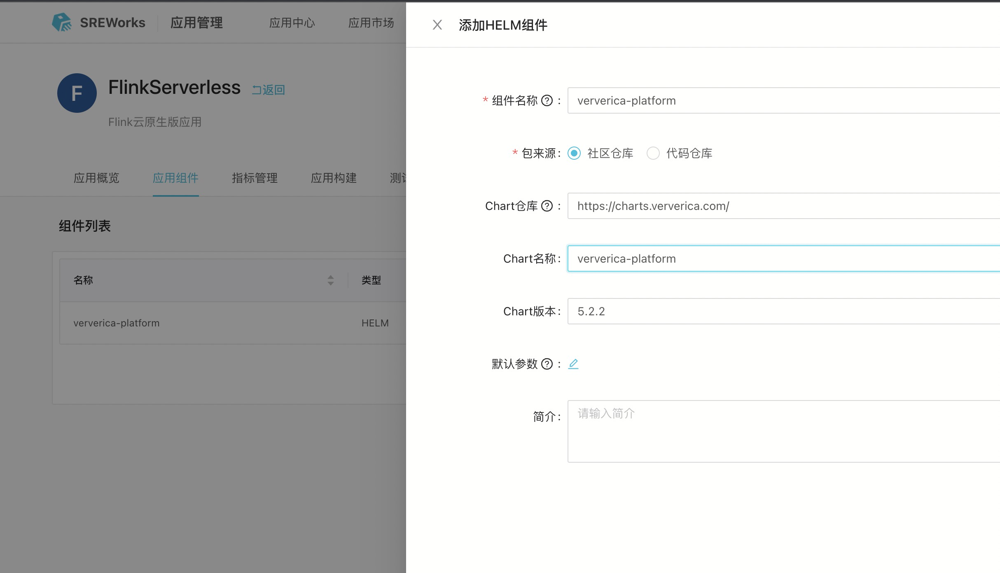
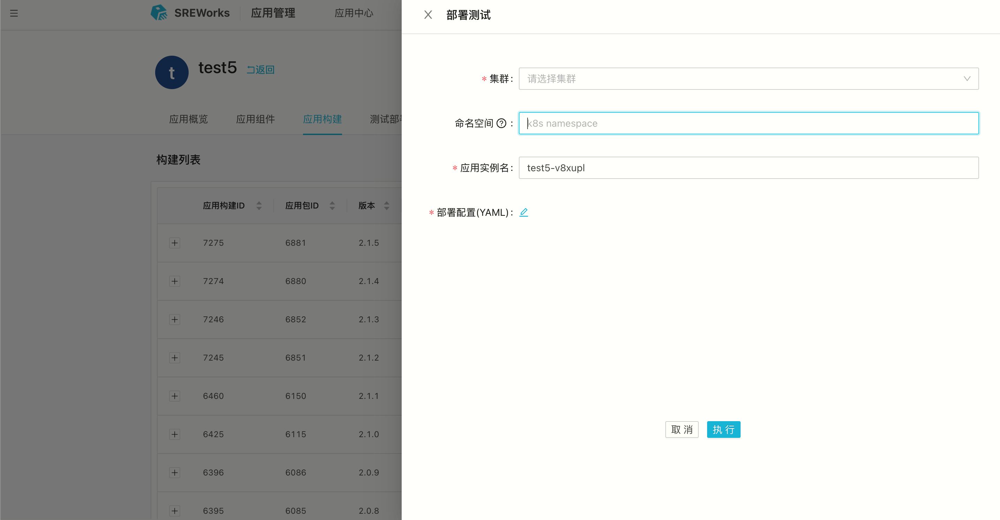
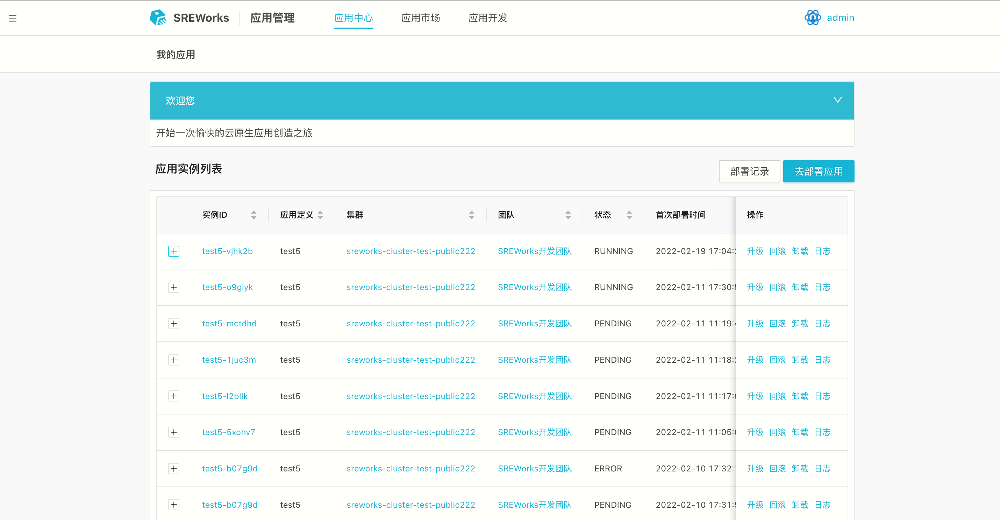

该文档描述在SREWorks中，从0到1建立一个Flink云原生应用定义，发布Flink应用到市场，并交付部署Flink应用的完整过程。

### 1 新建Flink应用
登录SREWorks后，进入“交付/应用管理-应用开发”页面，点击“新建云原生应用”，在滑出的表单中输入Flink应用定义相关信息，完成Flink应用模板定义 

在应用开发模板列表下，点击应用定义名称，进入应用开发页面 

### 2 添加Flink应用组件
进入Flink应用模板后，在应用组件中添加“Helm”组件类型，将Flink中的VVP组件添加进来 

### 3 Flink 应用构建
在完成组件添加后，可以在“应用构建”页面进行一键构建，当前一键构建会自动计算版本，创建构建任务后，在构建列表中可查看刚刚提交的构建任务。  构建完成后，即可在构建列表中展示当前构建的应用及组件构建状态，同时可以在操作中一键部署测试和上架市场。

### 4 Flink应用测试部署
应用测试实例支持多套部署，并会自动生成全局唯一的实例名，规则为“应用名-uid”。该实例被部署在同名的namespace下。  用户可自行对应用进行测试，测试通过后，可选择一键发布到市场的操作将应用版本发布到市场中。

### 5 Flink应用发布上架

通过构建列表中指定构建任务的“上架市场”操作完成应用到市场的发布。

### 7 Flink应用部署
在市场中可以指定应用一键部署，当前默认部署应用的最新版本。

### 8 Flink应用实例管理
应用实例列表展示当前部署在prod的企业应用生产实例，并提供升级、回滚、卸载操作。 
