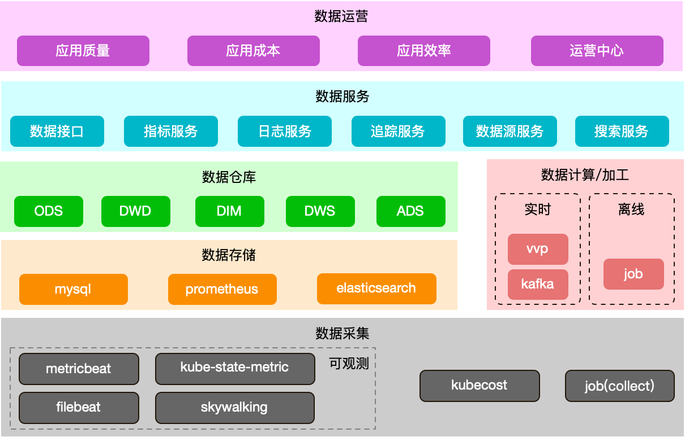
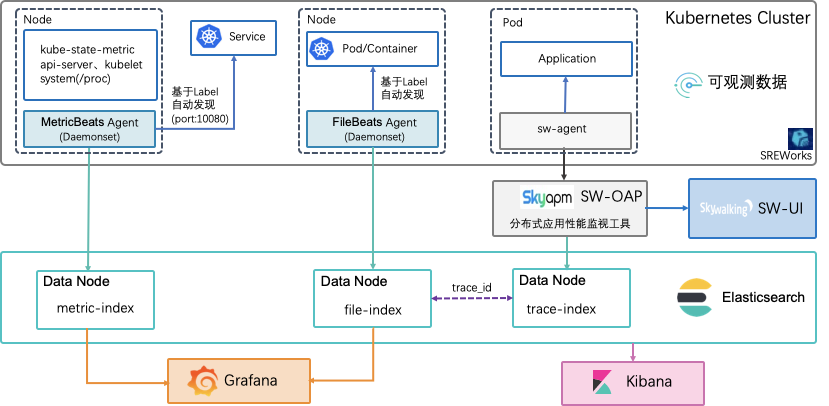
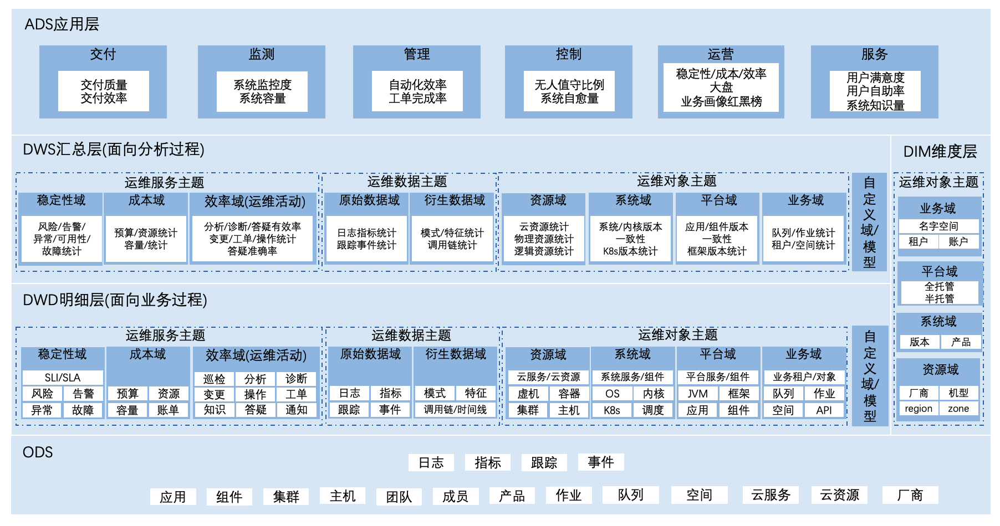
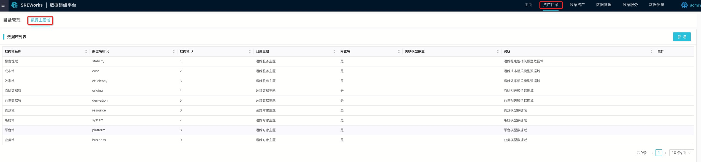
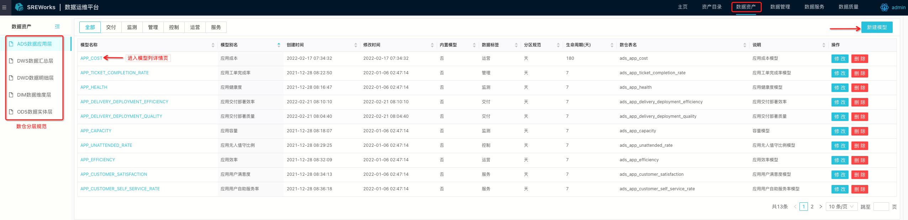
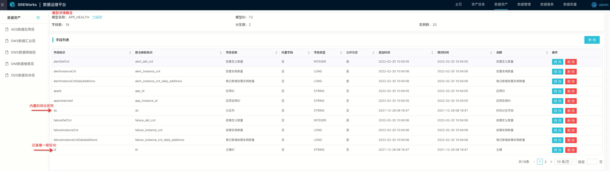
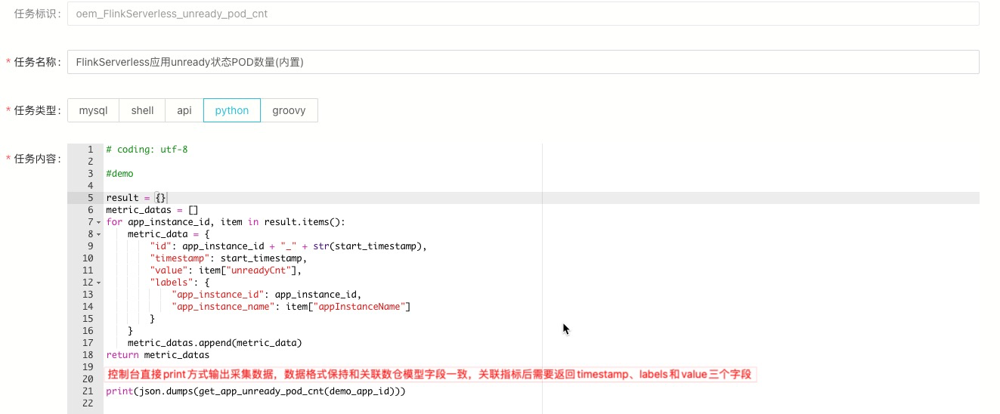
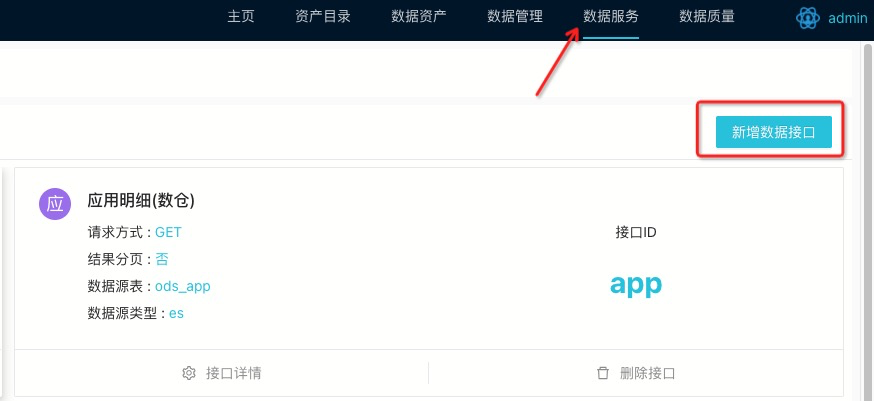
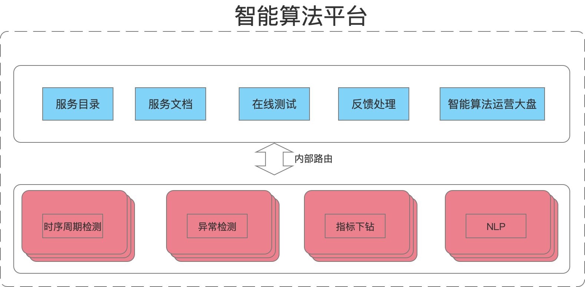
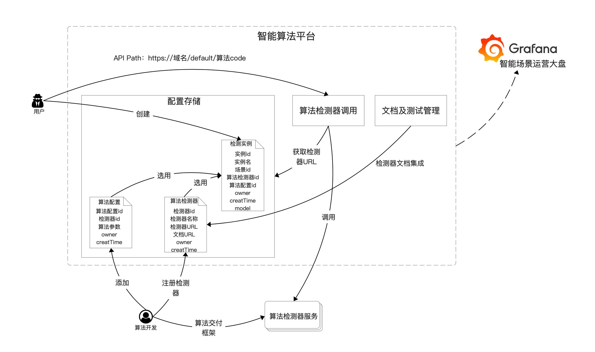

<a name="ey87a"></a>

## 1 数据化运维      
数据运维平台旨在通过数据技术，支持对海量数据的采集、计算、存储、加工和消费能力, 统一数据标准， 沉淀出运维领域数仓模型。基于数仓模型，提供规范化数据接入、聚合以及消费能力，能够让数据持续用起来，真正实现数据资产服务化，更好的支撑日常运维工作的量化和管理。

<a name="AdENm"></a>

### 1.1 功能简介

<a name="CWy8x"></a>

#### 1.1 数据采集

集成metricbeat、filebeat、skywalking等数据采集agent自动实现应用实例可观测数据采集<br />作业平台采集服务实现平台实体数据、业务自定义数据以及相关运维数据的采集

<a name="Tvzt6"></a>

#### 1.2 数据计算加工

开源的VVP平台，提供时序数据阈值检测、时序数据降采样，时序数据聚合等UDF库，满足用户常见的数据计算加工需求。<br />作业平台，用户可自定义数据计算加工ETL，同时可以将ETL作业输出与数仓模型进行关联。

<a name="LCRcC"></a>

#### 1.3 标准化运维数仓

基于elasticsearch存储的标准化运维数仓，抽象三大数据主题和九个数据域，内置涵盖云原生数据运维场景的数据实体和数据模型。同时具备灵活的用户自定义实体/模型能力，充分满足用户的个性化需求。

<a name="ue4yf"></a>

#### 1.4 数据服务

数据源服务提供数据源的配置与管理，除内置数仓关联的内部数据源外，还支持用户自定义数据源接入。<br />数据集服务提供快速将运维数仓模型存储数据表或者用户自定义数据源表生成API的能力，用户无需具备编码能力，即可快速配置数据接口，实现数据的管理和消费。目前优先支持elasticsearch和mysql数据源。<br />指标服务提供指标定义和指标实例的配置与管理，已经内置基础资源、基础性能指标，用户可以按需新增多种指标。

<a name="BhyVq"></a>

#### 1.5 应用运维运营

围绕应用实例，按照运维的质量、成本、效率三大维度，构筑应用运营中心，提供可视化应用运维运营大盘，满足日常运维工作的量化和管理需求。

<a name="ASupT"></a>

### 1.2 核心优势

基于云原生场景，依托SREWorks平台, 打通从数据采集、加工清洗、数据存储、数据消费整个链路, 实现开箱即用。

<a name="PpsSW"></a>

### 1.3 平台架构

<a name="viSB3"></a>

#### 1.3.1 平台整体架构



<a name="LTm5l"></a>

#### 1.3.2 数据采集架构

- 可观测数据/业务数据采集架构



<a name="zJVO2"></a>

#### 1.3.3 数据仓库架构

- 标准化运维数仓体系架构


<a name="zL5Ju"></a>

### 1.4 数据运维平台使用指南

<a name="hJPVw"></a>

#### 1.4.1 资产目录/数据资产(数仓模型/实体管理)

1. 进入**数据运维平台**，导航至**资产目录**页面，可以查看平台内置的三大数据主题和九个数据域，新建数据仓库模型前先规划该模型的主题域归属。<br /><br />2. 导航至**数据资产**页面，数仓分层规范位于左侧导航栏，选择合适分层后，即可左上角新**建模型/实体**按钮，即可新建数仓模型。数仓数据具有生命周期管理功能，用户可按需配置数据生命周期。<br /><br />        3. 新建完成后，数仓模型名称、分区规范，分层以及归属数据域均不可修改；点击模型列表模型名称列超链，即可进入列信息修改，默认会内置不可修改的ds分区字段，并强烈建议指定ID字段（用于记录唯一标识），数仓会默认按照ID字段进行记录的更新。<br />

<a name="b5EGH"></a>

#### 1.4.2 数据管理

1.数据采集：

方式一、依托作业平台方式，开放采集场景作业服务。用户可自主开发采集场景作业，支持关联数仓或指标。关联数仓模型的采集数据将落地到数仓管理，关联指标的采集数据可支持推送消息队列topic(sreworks-dataops-metric-data)，支持下游数据消费。<br />           

方式二、API方式，规范化灵活接入。数仓服务提供数据推送API，用户可以不用依赖作业平台采集服务就可实现数据录入数据仓库，通过SREWorks数据服务平台进行管理。

**按照ID进行数据录入**

 公共URL请求参数
```
id     // 数据实体/模型ID
type   // 数据实体/模型类型 实体： entity 模型：model
```
  <br />**单条 **请求内部地址
```
POST http://prod-dataops-warehouse.sreworks-dataops.svc.cluster.local:80/dw/data/push
```

body参数
```
{}   // JSON对象类型 按照数据实体/模型 字段规范提供
```

**批量(**单次最大1000条**) **请求内部地址 
```
POST http://prod-dataops-warehouse.sreworks-dataops.svc.cluster.local:80/dw/data/pushBatch
```

body参数
```
[{}, {}]   // JSON数组对象类型 按照数据实体/模型 字段规范提供
```

**按照名称进行数据录入**

 公共URL请求参数
```
name   // 数据实体/模型名称
type   // 数据实体/模型类型 实体： entity 模型：model
```

**单条** 请求内部地址
```
POST http://prod-dataops-warehouse.sreworks-dataops.svc.cluster.local:80/dw/data/pushByName
```

body参数
```
{}   // JSON对象类型 按照数据实体/模型 字段规范提供
```

**批量(**单次最大1000条**)** 请求内部地址
```
POST http://prod-dataops-warehouse.sreworks-dataops.svc.cluster.local:80/dw/data/pushBatchByName
```

body参数
```
[{}, {}]   // JSON数组对象类型 按照数据实体/模型 字段规范提供
```
 

2.数据源：提供数据运维平台的数据源管理功能，默认内置SREWorks的mysql和es数据源

<a name="Ppto7"></a>

#### 1.4.3 数据服务

数据消费通过数据接口将数据仓库的生成数据API，让数据用起来，目前优先支持mysql和es两种数据源。<br />开箱服务中，已经内置了30+数据接口。用户可以根据需要和页面提示自由添加所需数据接口。接口使用方式，数据集dataset的service([http://prod-dataops-dataset.sreworks-dataops.svc.cluster.local:80](http://prod-dataops-dataset.sreworks-dataops.svc.cluster.local:80))作为host，接口path作为url_path。




**补充说明：所有的开箱内置数据原则是上不放开给用户修改。**


<a name="wAki5"></a>

## 2 智能化运维      

智能运维平台依托数据平台能力，结合大数据沉淀的智能运维场景，在“感知、决策、执行”的闭环框架上增强智能加持，覆盖了包括异常检测(监控管理)、时序预测(资源管理)以及聚类服务等多种智能运维场景,为企业级用户提供智能化的IT运维服务，助力企业运维进入智能化时代，为业务发展保驾护航。

<a name="J4KnV"></a>

### 2.1 功能简介

<a name="j4G8m"></a>

#### 2.1.1 服务化智能运维服务

将智能运维服务以服务化的形式进行封装，提供服务文档、服务测试、服务调用、及调用分析的功能，帮助用户实现智能化运维与运维业务系统的解耦

<a name="zePh4"></a>

#### 2.1.2 检测器

检测器作为“智能感知”的承载体现，一个检测器对应一种智能化感知检测算法场景

<a name="XNn3C"></a>

#### 2.1.3 分析器

分析器作为“智能决策”的承载体现，一个分析器对应一种智能化诊断决策算法场景

<a name="VvgIH"></a>

#### 2.1.4 变更器

变更器作为“智能变更”的承载体现，一个变更器对应一种智能变更执行的策略算法场景

<a name="lLYz4"></a>

### 2.2 核心优势

抽象了一套智能“感知、决策、执行”的AIOps运维产品化框架，并将算法相关的能力集成在一个个“检测器、分析器、变更器”的抽象对象中，实现了服务化的智能运维能力。

<a name="OeE1E"></a>

### 2.3 平台架构
<br />
