SREWorks中针对企业云原生应用管理，提供了从开发、构建、发布到交付部署的完整端到端能力，覆盖常见的CI/CD/CO流程，以应用管理的SaaS形态提供。

<a name="gEUqn"></a>

## 1 应用开发
承载企业云原生应用的CI流程，用户可以新建应用，并一键构建和测试环境部署，在确定功能正常后可发布到应用市场。

<a name="HutKe"></a>

### 1.1 新建应用模板
登录SREWorks后，进入“交付/应用管理-应用开发”页面，会展示开发态的应用模板列表。<br />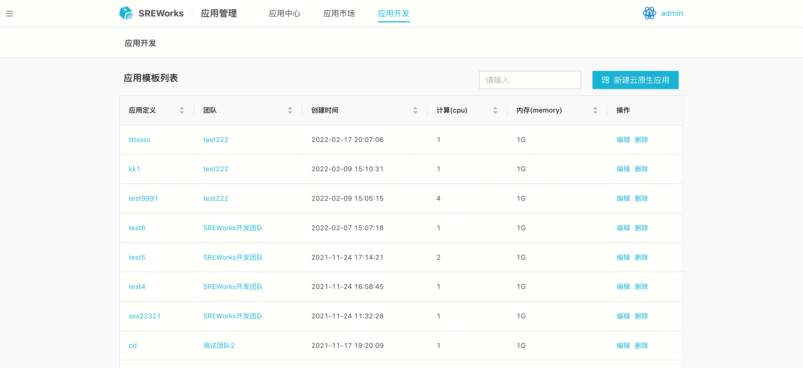<br />点击“新建云原生应用”，在滑出的表单中输入应用定义相关信息，即可完成应用模板定义<br />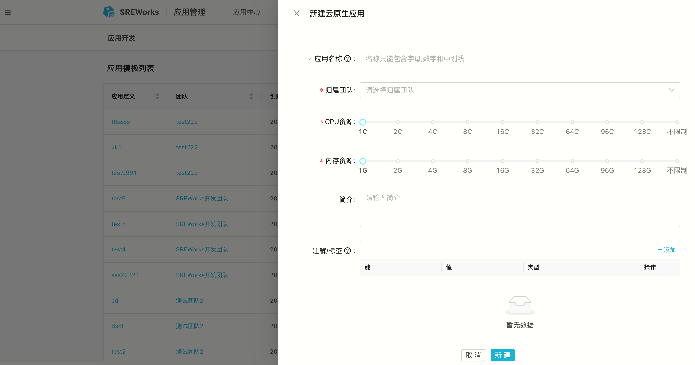

<a name="lAX7o"></a>

### 1.2 添加应用组件
当前支持两种内置组件类型的添加，“Helm类型”和“微服务类型”组件，用户可按自身应用架构进行选择，一个应用可以包含1到N个组件。 组件是企业应用的核心承载体。<br />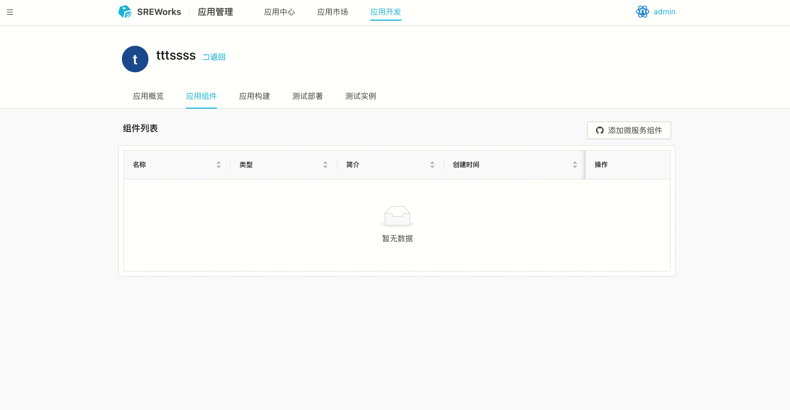

<a name="U19f2"></a>

### 1.3 应用构建
在完成组件添加后，可以在“应用构建”页面进行一键构建，当前一键构建会自动计算版本，创建构建任务后，在构建列表中可查看刚刚提交的构建任务。<br />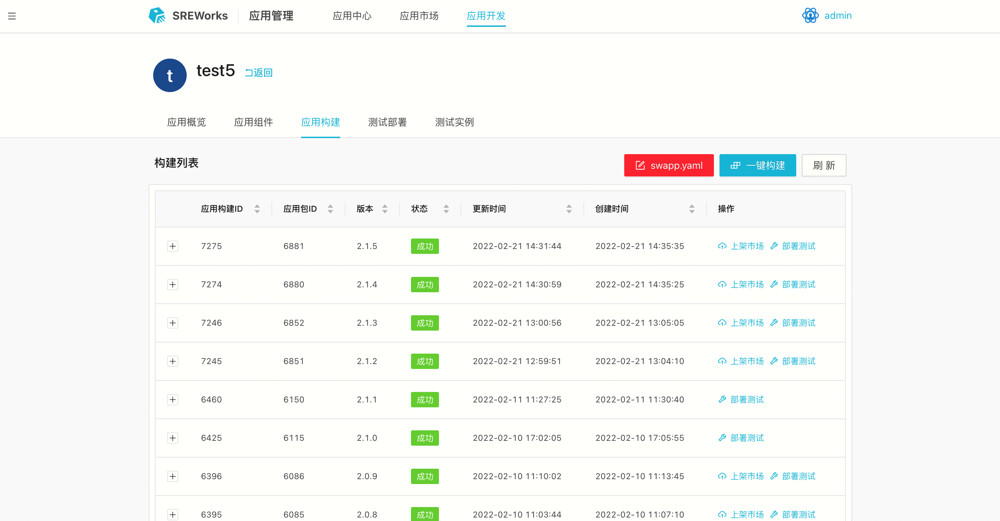<br />构建完成后，即可在构建列表中展示当前构建的应用及组件构建状态，同时可以在操作中一键部署测试和上架市场。

<a name="K8I4C"></a>

### 1.4 应用测试部署
应用测试实例支持多套部署，并会自动生成全局唯一的实例名，规则为“应用名-uid”。该实例被部署在同名的namespace下。<br /><br />用户可自行对应用进行测试，测试通过后，可选择一键发布到市场的操作将应用版本发布到市场中。

<a name="iBcye"></a>

### 1.5 应用发布

通过构建列表中指定构建任务的“上架市场”操作完成应用到市场的发布。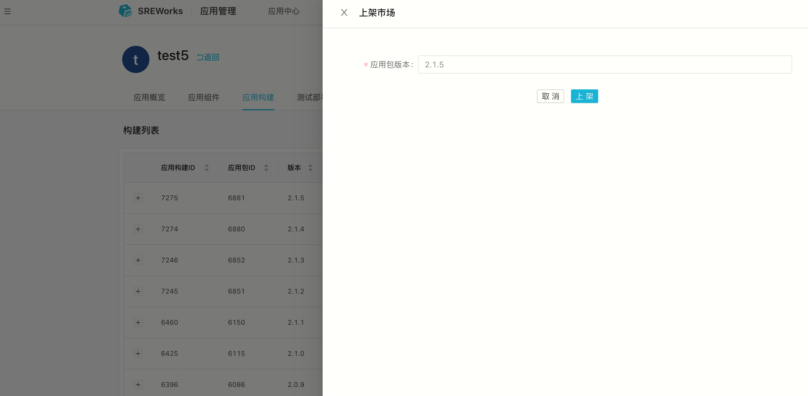
<a name="t3JV9"></a>

## 2 应用市场
应用市场用来分发企业应用的制品，在应用市场中是完成开发测试的稳定应用版本定义，同时应用市场的背后关联有具体的软件仓库，软件镜像制品在构建过程中都会上传到软件仓库。

<a name="Puqg4"></a>

### 2.1 应用部署
在市场中可以指定应用一键部署，当前默认部署应用的最新版本。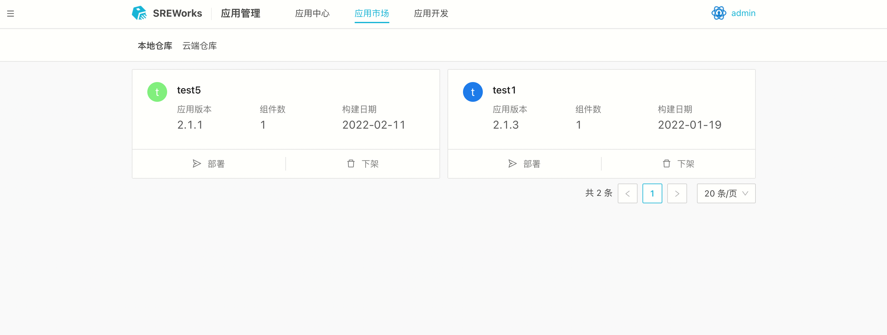
<a name="AZmOu"></a>

### 2.2 应用下架
在市场中可以指定应用一键下架，当前每次操作将下架该应用的当前最新版本，下架是需要输入应用名进行确认。<br />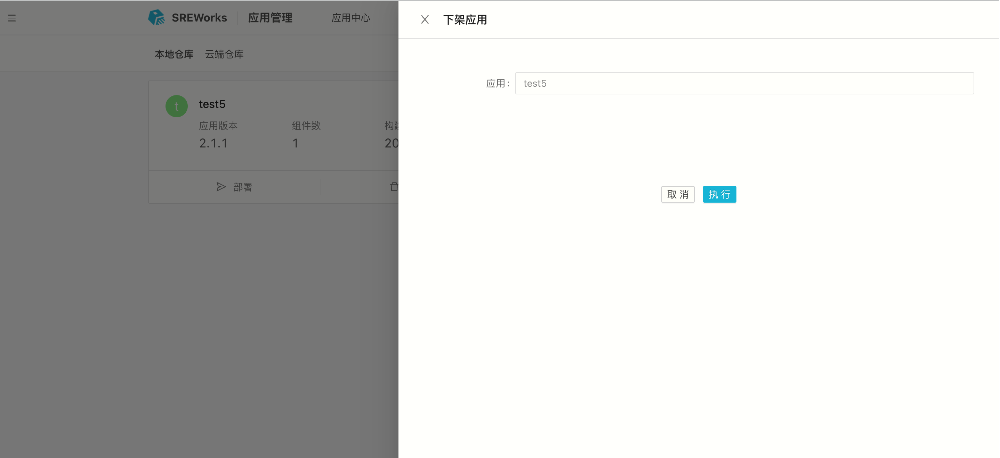
<a name="xJ9io"></a>

## 3 应用中心
应用中心是企业应用线上生产实例的管理中心，当前提供应用实例列表页面和应用详情管理页面。在实例列表中可对应用版本做升级回滚相关操作。
<a name="RfvwI"></a>

### 3.1 应用实例列表
应用实例列表展示当前部署在prod的企业应用生产实例，并提供升级、回滚、卸载操作。<br />

<a name="RBP5T"></a>

### 3.2 应用实例详情
在应用实例详情中提供了应用实例的概览、事件、组件、健康、指标、日志、跟踪等基本运维监控管理页面功能。<br />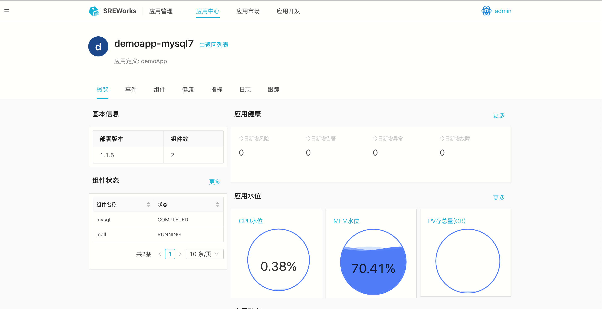

<a name="agoso"></a>

## 4 应用数据化配置管理

<a name="h1SjG"></a>

### 4.1 应用数据化配置

<a name="wyX8t"></a>

#### 4.1.1 应用指标定义

 指标定义页面可以开启内置指标（应用CPU水位、 应用RAM水位、 应用PVC分配量、 应用平均响应时间、 应用请求成功率、 应用unready状态POD数量）。开启后，会自动创建一个**基础指标采集作业，**用于基础内置指标的采集，同时指标数据会接入数仓服务。

另外，指标定义可以自动添加业务指标。添加的指标默认会打上** app_id**和**app_name**两个标签，用于标识指标归属当前应用定义。

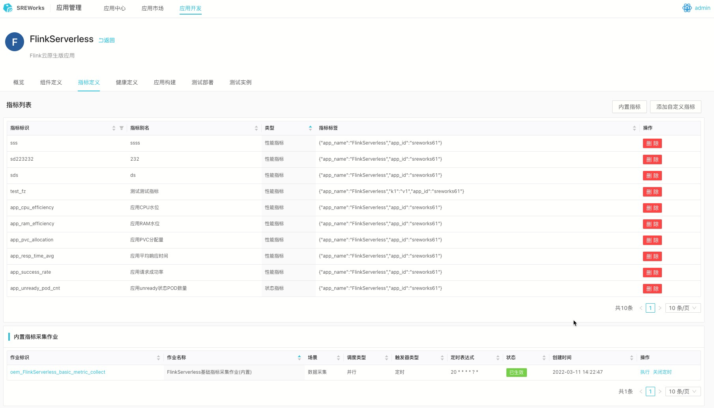

**指标数据采集**

方式一、通过作业平台采集服务。用户可创建关联指标的采集场景作业，关联指标的采集数据可支持推送消息队列topic(sreworks-dataops-metric-data)，支持下游数据消费。<br />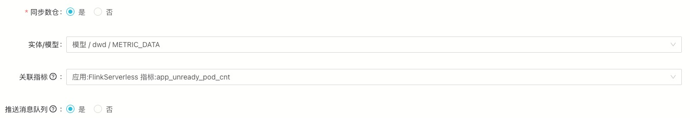

方式二、通过指标服务API

 公共URL请求参数
```
metricId         // 指标ID
isInsertNewIns   // 是否插入新增指标实例
isPushQueue      // 指标实例数据是否推送kafka消息队列topic(sreworks-dataops-metric-data)
```

**单条 **请求内部地址
```
POST http://prod-dataops-pmdb.sreworks-dataops.svc.cluster.local:80/metric_instance/pushMetricData
```

body参数
```
// JSON对象类型 
{
    "timestamp": 1640966400000,   // 时间戳ms
    "labels": {},                 // 指标labels,指标实例会自动添加指标定义标签
    "value": 1.0                  // 指标值
}   
```


**批量(**单次最大1000条**) **请求内部地址
```
POST http://prod-dataops-pmdb.sreworks-dataops.svc.cluster.local:80/metric_instance/pushMetricDatas
```
 <br />URL请求参数
```
isDeleteOldIns   // 是否删除不在本次录入范围的指标实例
```

body参数
```
// JSON数组对象类型 
[{
    "timestamp": 1640966400000,   // 时间戳ms
    "labels": {},                 // 指标labels,指标实例会自动添加指标定义标签
    "value": 1.0                  // 指标值
}]  
```

<a name="vLTOn"></a>

#### 4.1.2 应用健康定义

健康定义页面可以开启内置POD事件/POD状态的健康定义。开启后会针对POD运维事件进行采集，同时会针对应用POD不可用状态数量进行应用健康管理。如需对应用进行健康配置管理，请移步**健康管理服务**。

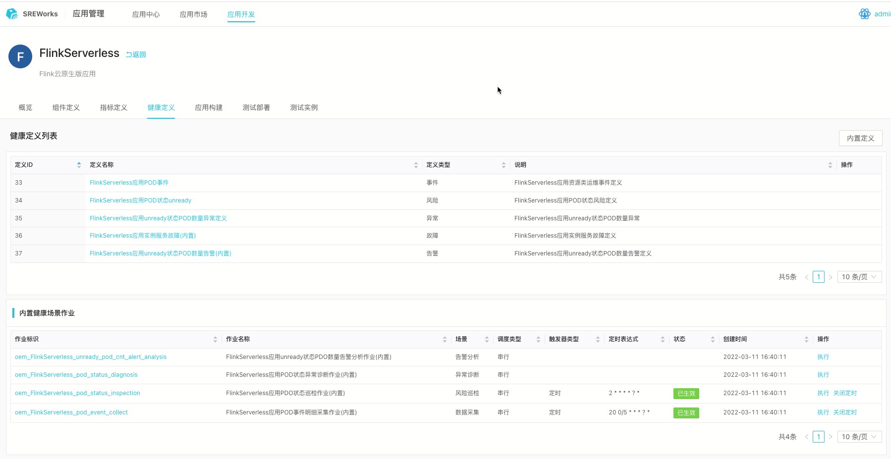

<a name="IDa9r"></a>

#### 4.1.3 应用可观测数据采集


**指标：**应用定义页面打开指标采集，会自动在应用实例POD添加标签 **kubernetes.labels.sreworks-telemetry-metric: enable **添加该标签实例会自动采集POD基础资源指标和POD状态指标数据

**日志：**应用定义页面打开日志采集， 会自动在应用实例POD添加标签 **kubernetes.labels.sreworks-telemetry-log: enable **添加该标签实例会自动采集POD产生的日志数据，默认按照时间切分日志行<br />eg:[2022-03-10 09:06:21] or 2022-03-10 09:06:21

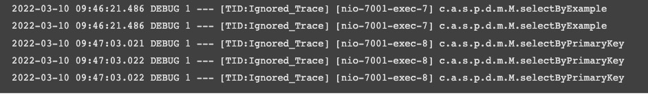

**追踪：**建议先阅读[Skywalking官方使用文档](https://skywalking.apache.org/docs/)，按照应用开发语言下载对应的skywalking-agent(这里以java为例，参考demoApp配置)：<br />a.[trace采集配置](https://skywalking.apache.org/docs/skywalking-java/v8.8.0/en/setup/service-agent/java-agent/readme/)<br />b.[log和trace关联配置](https://skywalking.apache.org/docs/skywalking-java/v8.8.0/en/setup/service-agent/java-agent/application-toolkit-logback-1.x/)<br />以上两部分配置成功后，即可将应用的可观测数据采集到SREWorks平台，进行管理。<br />  
<a name="gpjYM"></a>

#### 4.1.4 应用运维运营数据采集

依托作业平台，利用采集场景作业实现数据采集加工，关联**数据仓库**和**指标服务。**<br />1.基础运维数据：<br />**质量：**自动采集健康服务下应用的健康定义、健康实例等数据，并按照应用进行质量数据汇总<br />**成本：**自动按照应用维度采集每个POD的资源使用成本，并按照应用进行成本数据汇总<br />**效率：**自动采集应用的构建部署操作等数据，并按照应用进行效率数据汇总<br />应用的资源计价模型维护在**数仓DIM =>运维服务主题 =>成本域=>RESOURCE_PRICE, **用户可根据实际情况在系统设置中配置默认的资源计价。

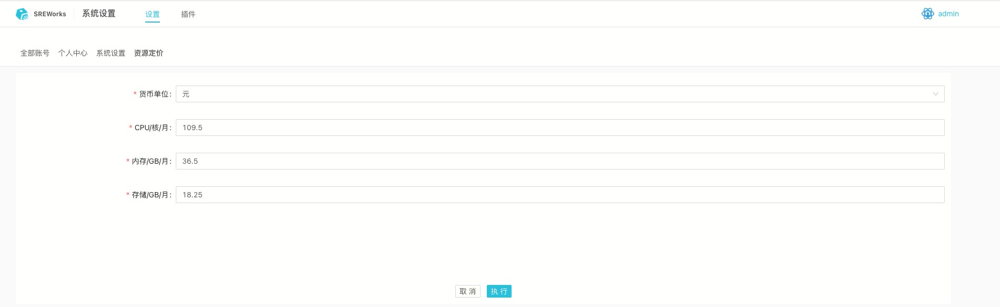

2.自定义业务数据：<br />用户按需创建具体的采集场景作业，采集数据到数仓。

<a name="qZrcO"></a>

### 4.2 应用数据化管理

<a name="knO9C"></a>

#### 4.2.1 应用实例事件详情

开启内置健康定义的应用定义，在应用实例的事件详情页可以看到，当前应用实例的POD运维事件。如果用户创建了其他事件定义，同样可以看到自定义的应用事件实例。

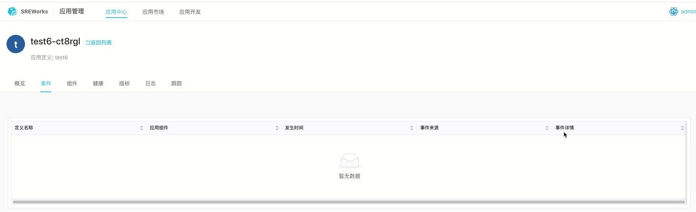

<a name="Px0RU"></a>

#### 4.2.2 应用实例健康详情

应用实例的健康（风险、告警、异常、故障）看板。通过该页面可以细粒度的看到应用的健康概览数据、详情数据以及健康趋势图。

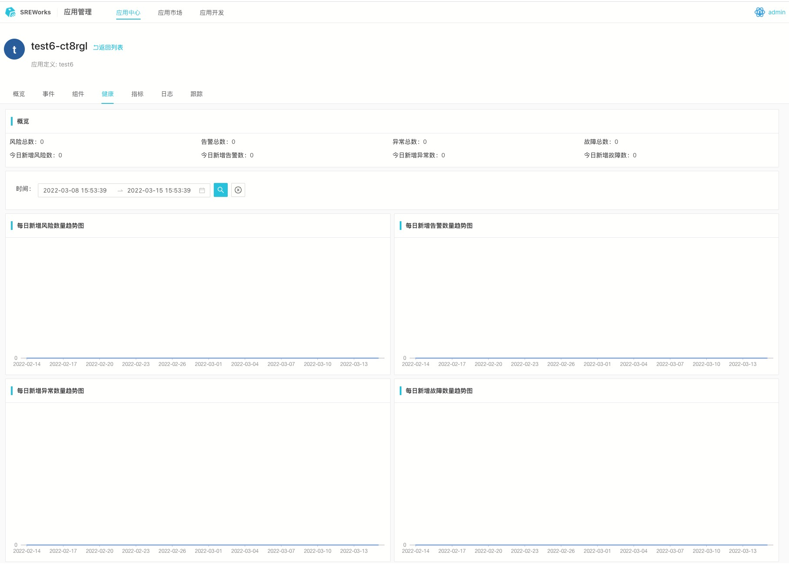

<a name="AnSKy"></a>

#### 4.2.3 应用实例指标详情

应用实例指标列表和指标时序曲线查看

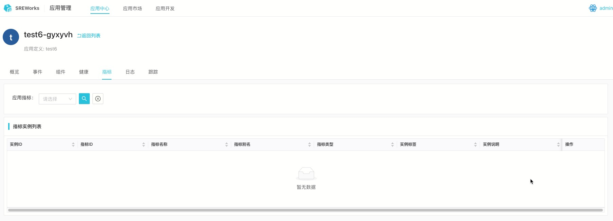

<a name="OhdUv"></a>

#### 4.2.4 应用实例日志详情

应用实例日志数据，支持按照追踪ID和日志关键字进行过滤。如需查看日志详情，请通过日志列表右上角grafana链接跳转到日志explore面板(user:admin  passwd:sreworks123456)

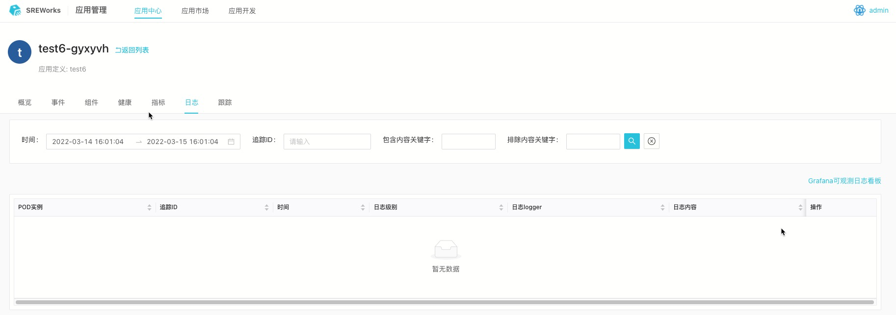

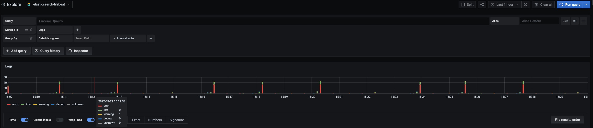

<a name="J14xQ"></a>

#### 4.2.5 应用实例追踪详情

应用实例追踪数据，可根据追踪ID跳转SkyWalking UI页面，进行追踪详情查询。

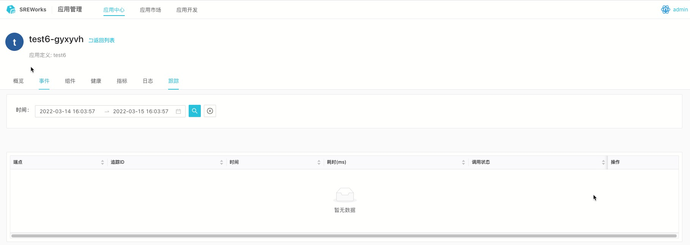

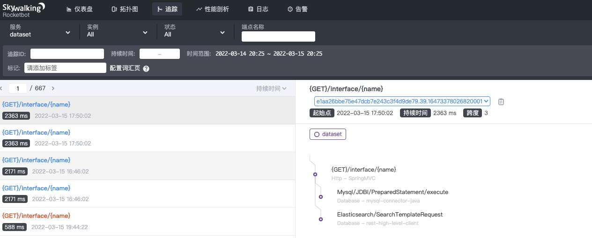

<a name="Vp1WF"></a>

## 5 应用健康管理和故障自愈

<a name="LgkIS"></a>

### 5.1 健康管理

<a name="S5pQe"></a>

#### 5.1.1 健康主页

健康服务汇总看板

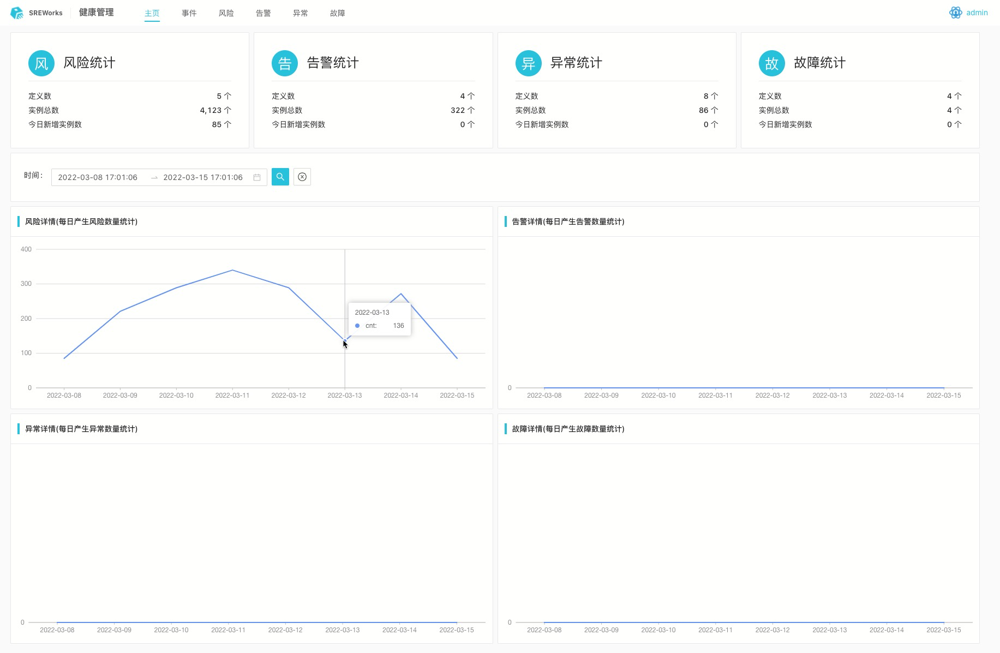

<a name="ZoO0C"></a>

#### 5.1.2 事件管理

事件定义和事件实例的管理页面，事件定义需要关联到应用定义。

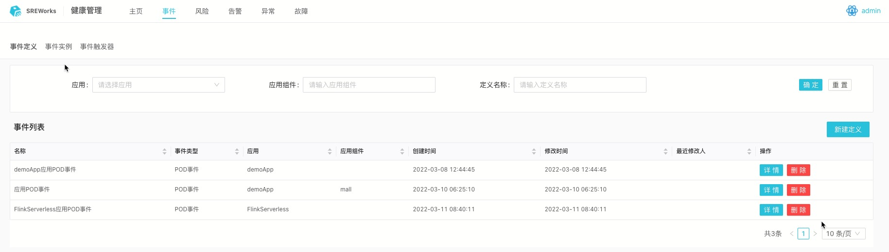

<a name="OoSQh"></a>

#### 5.1.3 风险管理

风险定义和风险实例的管理页面，风险定义需要关联到应用定义。启用状态的风险可以关联巡检作业，产出风险实例。同时可以对风险定义配置权重值(0-10)，用于应用健康分计算。

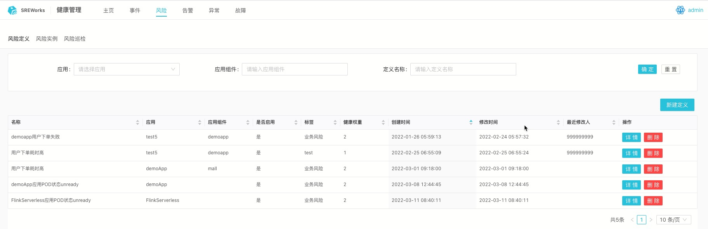

风险巡检页面，创建巡检场景作业，关联多个巡检项，巡检项可以绑定到具体的风险定义(启用状态)，满足条件即可产出对应的风险实例。

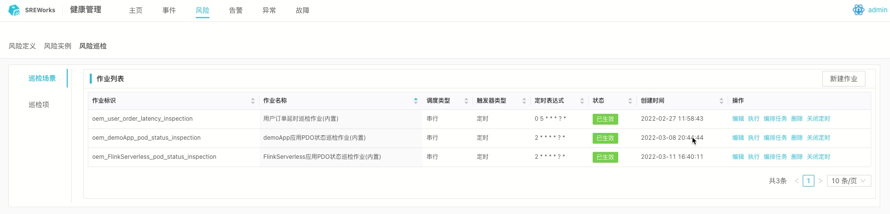<br />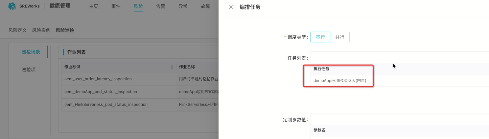<br />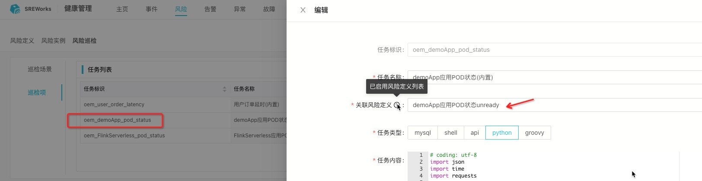

<a name="zzAKO"></a>

#### 5.1.4 告警管理

告警定义和告警实例的管理页面，告警定义需要关联到应用定义。当告警定义处于启用状态时， 告警定义绑定的指标会通过阈值检测服务，根据告警规则产出告警实例。同时可以对告警定义配置权重值(0-10)，用于应用健康分计算。说明，故障定义规则，生效时间在30min左右(flink维表缓存时长)。此外，当前版本暂不支持告警消息推送，后续会开放支持。

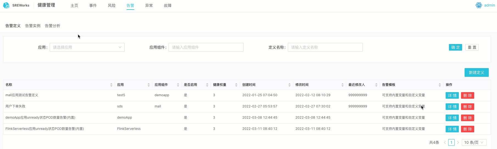<br />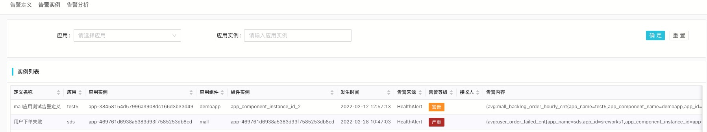<br />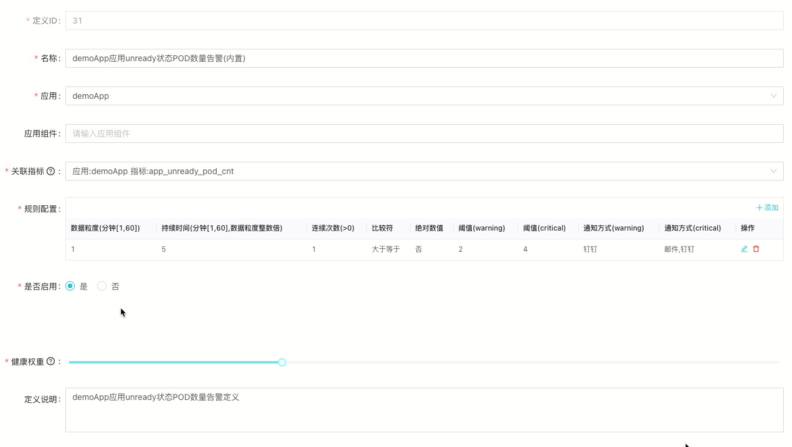

告警分析页面，创建告警分析场景作业，可以订阅启用状态的告警，该作业绑定的分析项可以获取订阅告警产出的告警实例，进行告警数据分析。同时告警分析项可以关联下游的异常，当满足条件时，产出对应的异常实例（下游异常实例通过关键字nextIncident标识）。

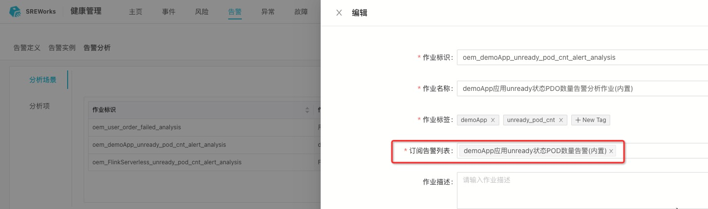

告警实例放在环境变量varConfPath<br />python脚本为例，

```python
# 获取方式
result = json.loads(open(os.getenv("varConfPath")).read())
# 回写方式
open(os.getenv("varConfPath"), 'w').write(json.dumps(result))
```

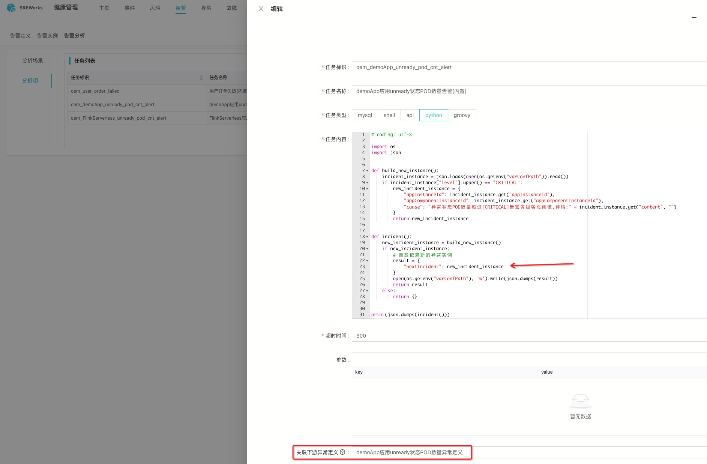

<a name="MN4ZI"></a>

#### 5.1.5 异常管理

异常定义和异常实例的管理页面，异常定义需要关联到应用定义。开箱内置不可用异常类型。异常定义可以配置是否支持自愈，支持自愈的异常表示可以进行故障自愈。同时可以对异常定义配置权重值(0-10)，用于应用健康分计算。

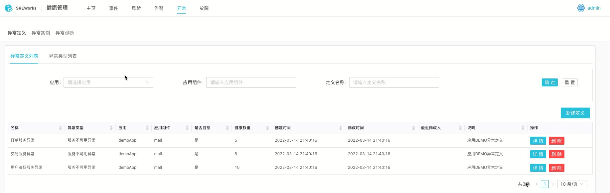<br />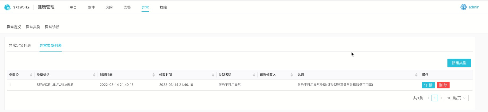

异常诊断页面，开启自愈的异常可以被诊断场景作业订阅，该作业绑定的诊断项可以获取订阅异常产生的异常实例，进行异常实例诊断。同时诊断项可以关联下游的异常，当满足条件时，产出对应的异常实例（下游异常实例通过关键字nextIncident标识，当前异常实例通过关键字currentIncident标识）。

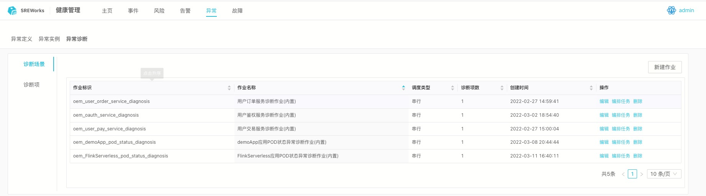

异常实例放在环境变量varConfPath<br />python脚本为例，

```python
# 获取方式
result = json.loads(open(os.getenv("varConfPath")).read())
# 回写方式
open(os.getenv("varConfPath"), 'w').write(json.dumps(result))
```

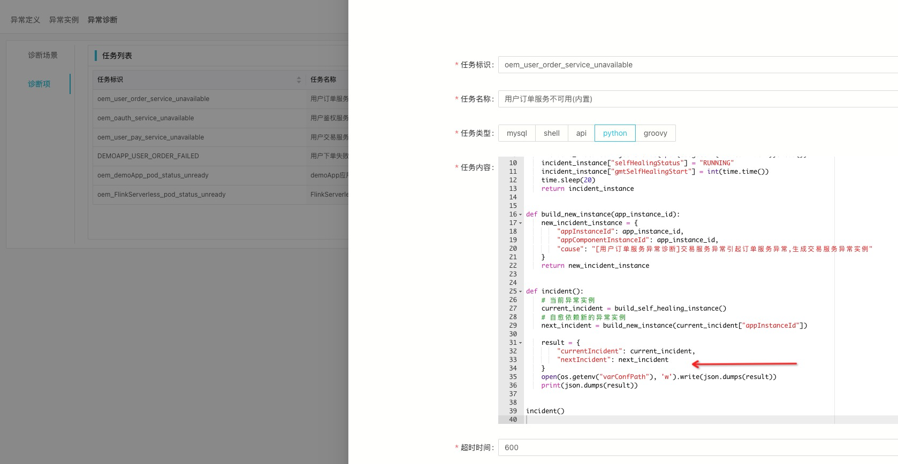

开启自愈的异常实例，存在如下五种状态<br /># WAITING 等待自愈状态 （新产生异常实例首先进入等待自愈状态）<br /># RUNNING 自愈中<br /># FAILURE 自愈失败<br /># SUCCESS 自愈成功<br /># CANCEL 自愈任务取消<br />用户可以结合实际情况对异常实例状态进行合理轮转

<a name="dpzhX"></a>

#### 5.1.6 故障管理

故障定义和故障实例的管理页面，故障定义需要关联到应用定义。故障实例由其关联异常实例，满足故障条件后自动产出。按照异常持续时间，平台内置P4～P0(由低到高)五级故障，用户可以结合异常的重要性进行合理配置。说明，故障定义规则同告警规则一样，生效时间在30min左右(flink维表缓存时长)。

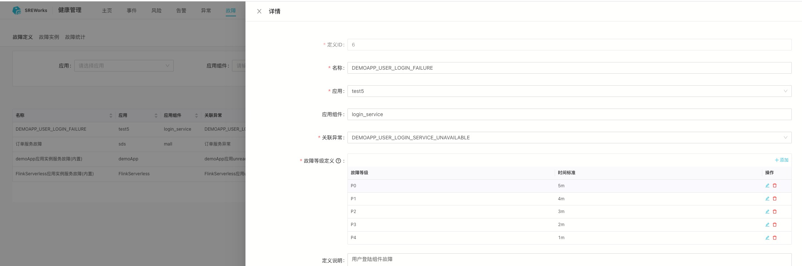

<a name="nG4ed"></a>

#### 5.1.7 应用健康分 

应用健康分(满分100)采用扣分项机制，根据应用实例关联的健康实例(风险、告警、异常)，结合权重系数和影响因子，计算每个扣分项，最终计算得到每个实例的健康分值。

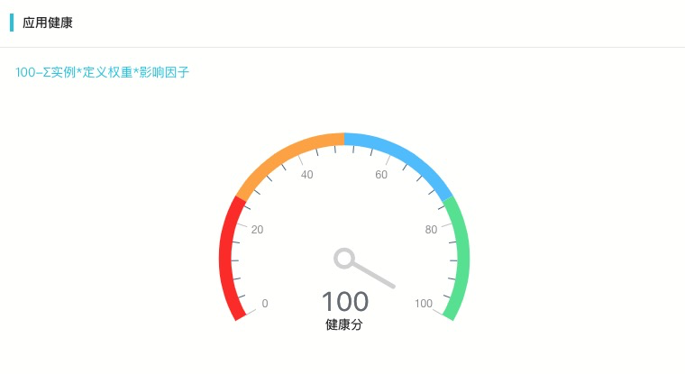

<a name="HRFNG"></a>

### 5.2 故障自愈

自愈任务链的统计数据和自愈任务详情数据

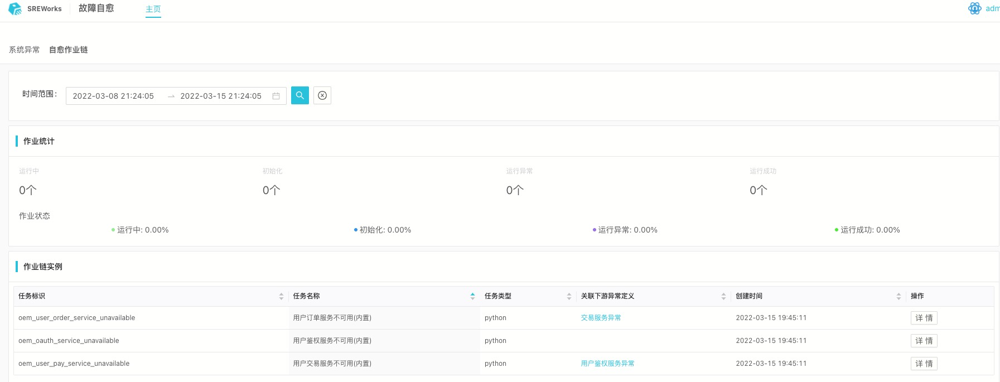

<a name="AplSh"></a>

## 6 应用运营管理

运营中心按照应用实例从质量、成本、效率三个维度，分别进行数据统计汇总

<a name="rWUtf"></a>

### 6.1 运营中心概览

概览页面，按照质量、成本、效率三个维度，汇总上层指标数据，<br />健康：健康分和服务可用率，以及健康实例的统计数据<br />成本：应用的占比和资源用量统计<br />效率：应用人效比和构建部署数据统计

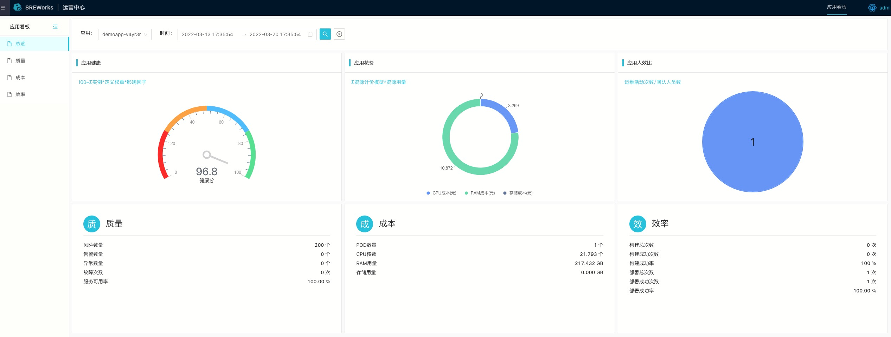
<a name="zjZ5v"></a>

### 6.2 应用质量运营管理

应用实例每日新增风险、告警、异常以及故障实例趋势图

<a name="rxIBz"></a>

### 6.3 应用成本运营管理

应用实例每日平均资源水位趋势图

<a name="aOySq"></a>

### 6.4 应用效率运营管理

应用每日构建部署成功率趋势图
