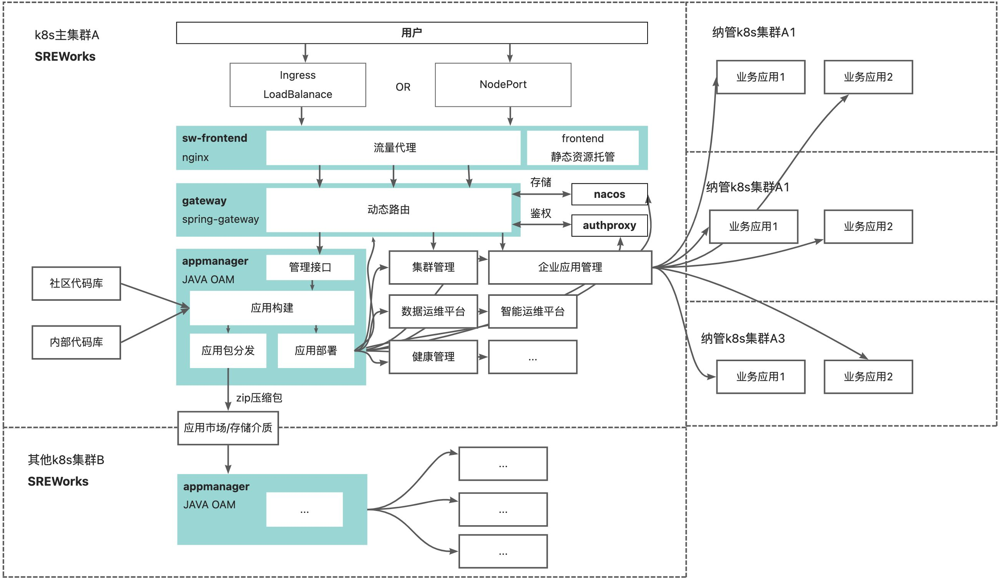

<a name="VDP4m"></a>

### 1. 部署SREWorks的基础条件是什么？
您需要一个Kubernetes集群。SREWorks专为云原生下的运维而生，同时SREWorks自身也是基于云原生架构的落地实现。


<a name="pyyIT"></a>

### 2. Appmanager运行报错，无法创建新线程
```
java.lang.OutOfMemoryError: unable to create native thread
```
需要将 /var/lib/kubelet/config.yaml 中的 `podPidsLimit: 1000` 改为 `podPidsLimit: -1`

<a name="LYcu3"></a>

### 3. Helm包有哪些安装参数?
```shell
# 平台名称
--set platformName="SREWorks"

# 平台图标, icon格式要求（比如：48*48）
--set platformLogo="https://sreworks.oss-cn-beijing.aliyuncs.com/logo/demo.png" 

# 底层存储
--set global.storageClass="alicloud-disk-available"

# SREWorks平台启动使用的容器镜像仓库
--set global.images.registry="registry.cn-zhangjiakou.aliyuncs.com/sreworks"

# SaaS容器构建镜像仓库配置
--set appmanager.server.docker.account="sreworks"
--set appmanager.server.docker.password="***"
--set appmanager.server.docker.registry="registry.cn-zhangjiakou.aliyuncs.com"
--set appmanager.server.docker.namespace="builds"

# 源码构建模式的源码仓库来源
--set source.branch="master"
--set source.repo="https://code.aliyun.com/sreworks_public/mirror.git"


# 替换基础应用的主MySQL数据库
# MySQL这块需要注意，通常将主MySQL数据库和数智化MySQL数据库(吞吐较大)分成两个

--set appmanager.server.database.host="*.mysql.rds.aliyuncs.com" 
--set appmanager.server.database.password="****"
--set appmanager.server.database.user="root"
--set appmanager.server.database.port=3306
--set appmanagerbase.mysql.enabled=false

# 替换数智化应用的MySQL数据库
--set saas.dataops.dbHost="*.mysql.rds.aliyuncs.com"
--set saas.dataops.dbUser=root
--set saas.dataops.dbPassword="*****"
--set saas.dataops.dbPort=3306

# 替换数智化应用的ElasticSearch
--set saas.dataops.esHost="*.public.elasticsearch.aliyuncs.com"
--set saas.dataops.esPort="9200"
--set saas.dataops.esUser="elastic"
--set saas.dataops.esPassword="*******"

# 替换基础应用的MinIO存储
--set global.minio.accessKey="*******"
--set global.minio.secretKey="*******"
--set appmanager.server.package.endpoint="minio.*.com:9000"
--set appmanagerbase.minio.enabled=false
```

<a name="LdEAB"></a>

### 4. SREWorks的架构拓扑是怎么样的？



<a name="AYcoD"></a>

### 5. Skywalking oap-server启动失败，报错table: xxx does not exist. OAP is running in 'no-init' mode, waiting... retry 3s later.
这个是由于Skywalking的TTL失效bug引起，目前最新的9.2.0版本还未修复，但master分支已经修复，具体详情可以先参考[官方issue](https://github.com/apache/skywalking/issues/4938)。如遇这种情况，当前可以先删除相应的index和template，在进行服务重启。
