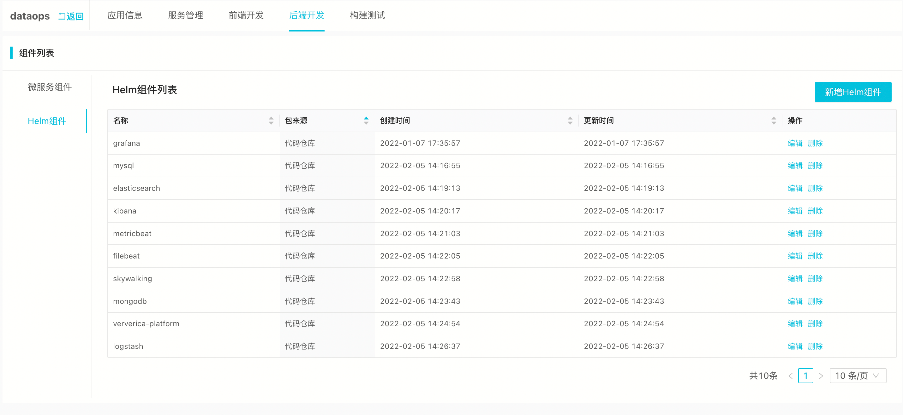
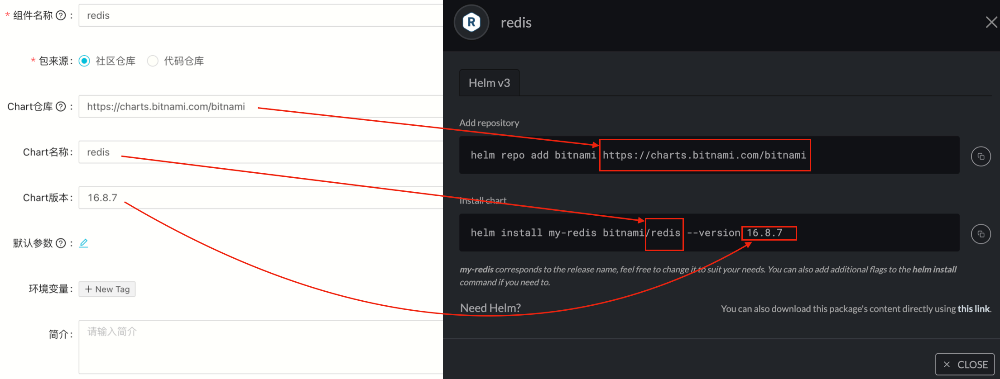

<a name="VDP4m"></a>

### 1. 部署SREWorks的基础条件是什么？
您需要一个Kubernetes集群。SREWorks专为云原生下的运维而生，同时SREWorks自身也是基于云原生架构的落地实现。

<a name="uxaTe"></a>

### 2. 数据运维平台（dataops）应用默认部署的组件有哪些？
开源版SREWorks中基于流行的业界开源软件构筑了运维数仓及数据采集加工等相关能力，其中以Elasticsearch和vvp（flink的云原生版本）为主。<br />

<a name="biXgt"></a>

### 3. v1.1版本支持数据组件可插拔能力会带来哪些变化？
数据组件可插拔功能即可以给用户带来更大灵活性，也使得SREWorks易用性得到极大提高。新版本将ElasticSearch、MySQL以及MinIO等通过抽取部署变量方式实现组件的可插拔能力。<br />**ElasticSearch**:

   - v1.0版本内置ES默认不开启用户认证，V1.1新版本内置ES实例默认开启内置用户(elastic)认证功能，后续用户在使用ES服务时需要带认证信息访问。
```shell
curl --output /dev/null -u "elastic:${ELASTICSEARCH_PASSWORD}" "http://localhost:9200"
```

   - 内置ES实例，默认安装elasticsearch-analysis-ik分词器，用于站点搜索服务。替换成用户自定义ES实例后，需要手工安装该插件，否则搜索服务无法正常使用，[移步安装指南](https://github.com/medcl/elasticsearch-analysis-ik)
   - 推荐ES实例版本 7.0+

<a name="cB4Be"></a>

### 4. 如何填写组件中的HELM社区仓库

<a name="pyyIT"></a>

### 5. Appmanager运行报错，无法创建新线程
```
java.lang.OutOfMemoryError: unable to create native thread
```
需要将 /var/lib/kubelet/config.yaml 中的 `podPidsLimit: 1000` 改为 `podPidsLimit: -1`

<a name="LYcu3"></a>

### 6. Helm包有哪些安装参数?
```shell
# 平台名称
--set platformName="SREWorks"

# 平台图标, icon格式要求（比如：48*48）
--set platformLogo="https://sreworks.oss-cn-beijing.aliyuncs.com/logo/demo.png" 

# 底层存储
--set global.storageClass="alicloud-disk-available"

# SREWorks平台启动使用的容器镜像仓库
--set global.images.registry="registry.cn-zhangjiakou.aliyuncs.com/sreworks"

# SaaS容器构建镜像仓库配置
--set appmanager.server.docker.account="sreworks"
--set appmanager.server.docker.password="***"
--set appmanager.server.docker.registry="registry.cn-zhangjiakou.aliyuncs.com"
--set appmanager.server.docker.namespace="builds"

# 源码构建模式的源码仓库来源
--set source.branch="master"
--set source.repo="https://code.aliyun.com/sreworks_public/mirror.git"


# 替换基础应用的主MySQL数据库
# MySQL这块需要注意，通常将主MySQL数据库和数智化MySQL数据库(吞吐较大)分成两个

--set appmanager.server.database.host="*.mysql.rds.aliyuncs.com" 
--set appmanager.server.database.password="****"
--set appmanager.server.database.user="root"
--set appmanager.server.database.port=3306
--set appmanagerbase.mysql.enabled=false

# 替换数智化应用的MySQL数据库
--set saas.dataops.dbHost="*.mysql.rds.aliyuncs.com"
--set saas.dataops.dbUser=root
--set saas.dataops.dbPassword="*****"
--set saas.dataops.dbPort=3306

# 替换数智化应用的ElasticSearch
--set saas.dataops.esHost="*.public.elasticsearch.aliyuncs.com"
--set saas.dataops.esPort="9200"
--set saas.dataops.esUser="elastic"
--set saas.dataops.esPassword="*******"

# 替换基础应用的MinIO存储
--set global.minio.accessKey="*******"
--set global.minio.secretKey="*******"
--set appmanager.server.package.endpoint="minio.*.com:9000"
--set appmanagerbase.minio.enabled=false
```

<a name="LdEAB"></a>

### 7. SREWorks的架构拓扑是怎么样的？


