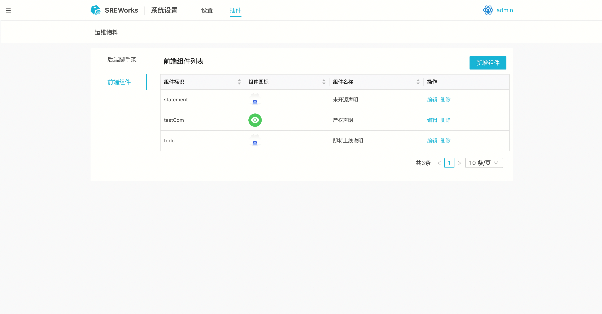
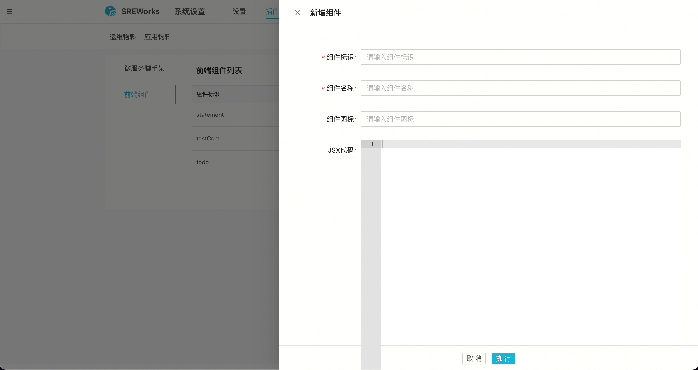
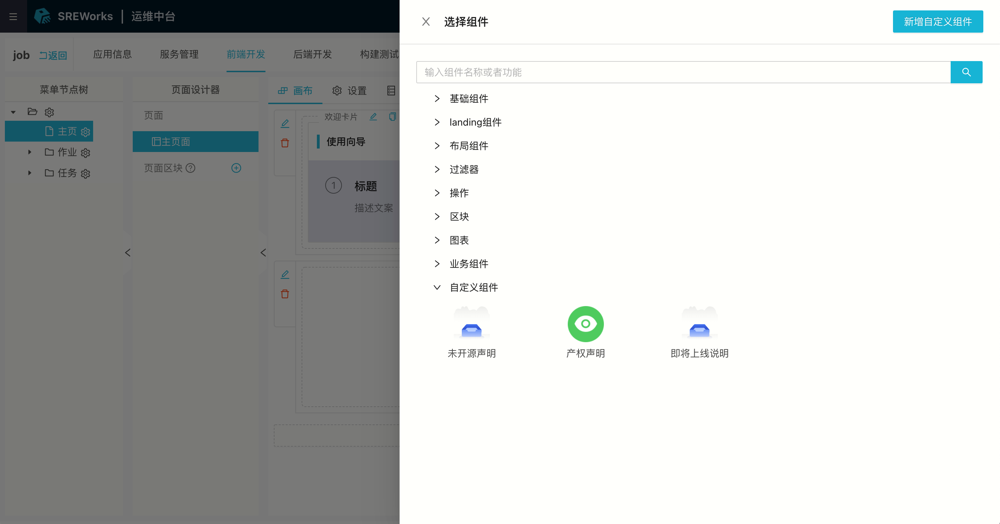
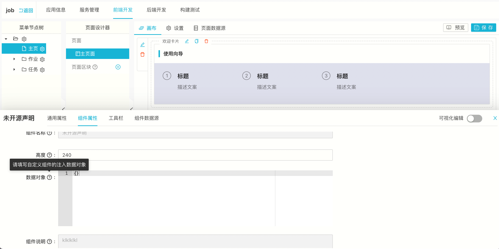

在运维前端开发中配置页面组件时，SREWorks内置了一些前端组件，按照分类列表展示。用户也可以按照前端组件开发指南，自定义实现一些基础组件或业务组件。当前从界面提供的前端组件动态扩展组件只支持jsx 类型的组件，后续将提供react js 原生组件的动态扩展支持。

## JSX前端模板组件扩展

### 注册组件
在“管理/系统设置-插件-运维物料-前端组件”功能页签下，维护了当前扩展的JSX前端模板组件

点击执行“新建组件”，在侧滑表单中输入组件相关信息，即可动态向SREWorks注入JSX类型前面模板组件，后续在运维开发中即可使用该组件 

### 使用组件
在运维中台-运维开发菜单下，进入运维应用开发IDE，选择前端开发页签，在页面开发设计器中，可以选择到前面注册的JSX模板组件，并进入配置完成组件配置。   如果组件比较复杂，有数据对象注入，可动态注入变量，实现更丰富的组件能力 

### 
