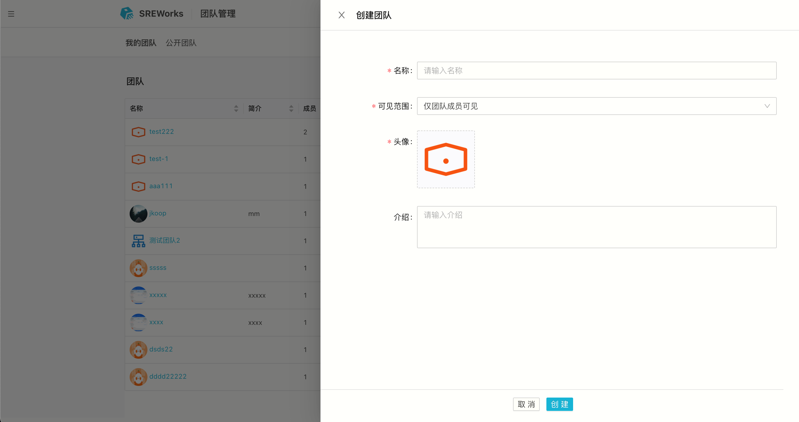
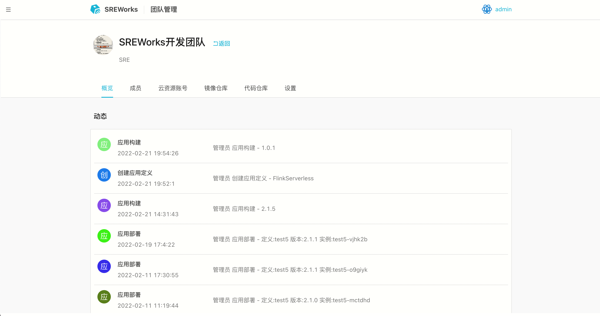
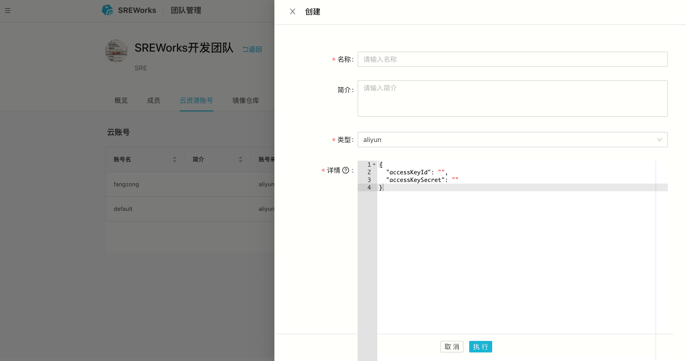
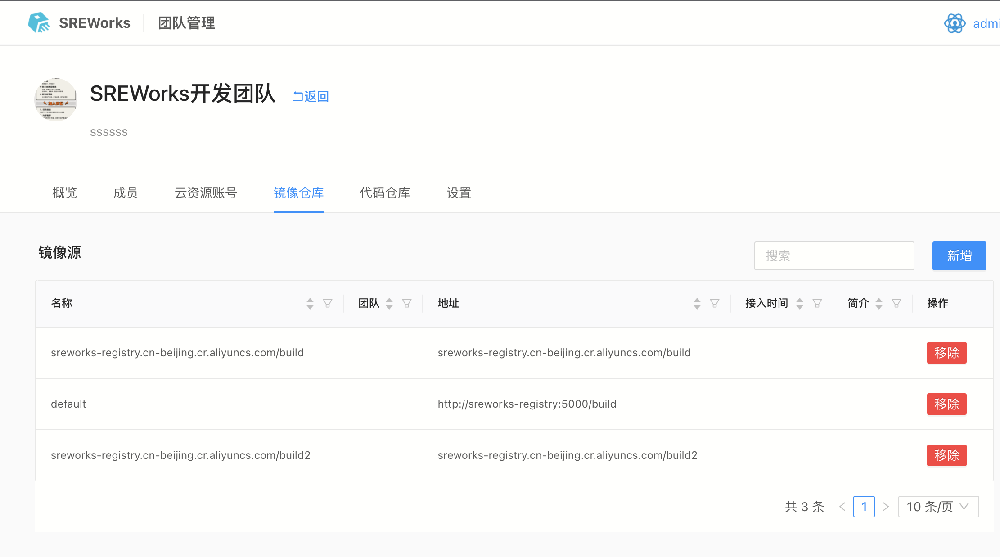
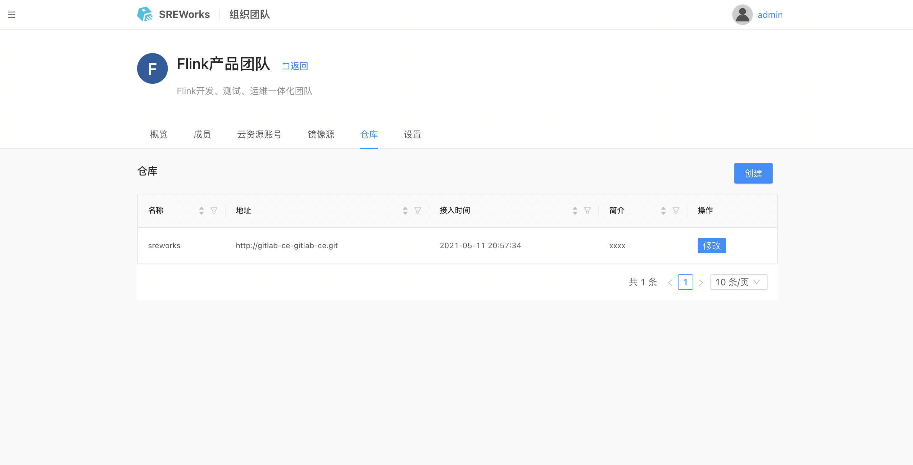
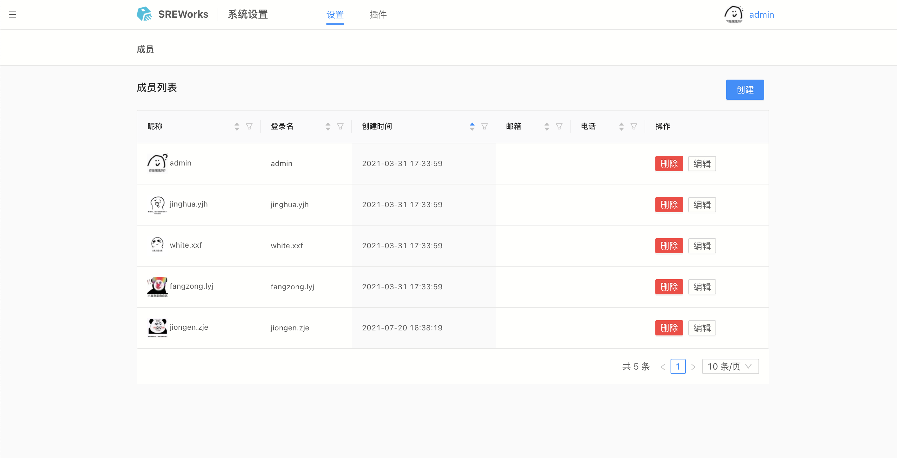
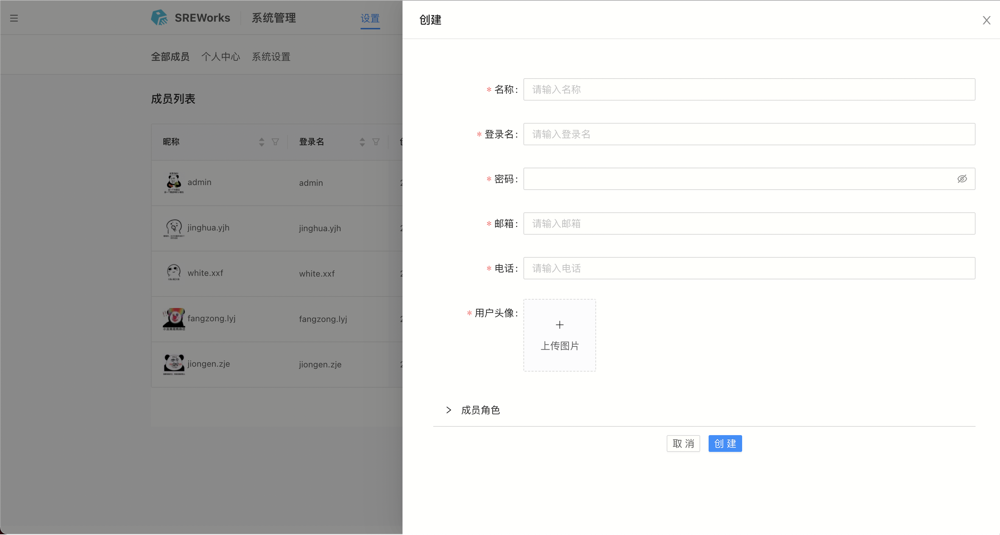
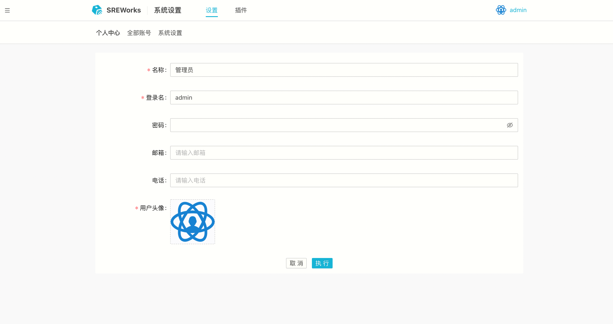

## 团队管理

不同的企业，其组织架构也千差万别，我们在SREWorks中设计了一套抽象通用的扁平化虚拟组织管理模型 —— 团队（Team），团队可以映射组织架构里的一个真实团队，也可以映射为一个项目团队、产品团队，或者是一个战役，甚至可以是一项兴趣爱好的组织。每个人可以加入一到多个团队，团队有可见范围属性：仅团队成员可见、全部可见，当设置为全部可见时，则是一个公开团队，全员都可以看见。

### 新建团队
新建团队，输入团队名称、介绍，选择可见范围，设置团队头像即可完成团队的创建。  点击团队，进入团队详情页面，可对团队进行管理，功能包括成员管理、云资源账号管理、镜像仓库管理、代码仓库管理以及团队设置。团队设置里包含基础设置和高级设置，高级设置可删除该团队，注意，删除团队会将录入的资源账号和仓库信息等一并删除，请谨慎删除。 

### 成员管理
在成员管理中可维护成员列表，添加成员时可指定成员在团队里的角色，当前团队成员有管理员和成员两种角色，管理员可删除其他成员和团队，成员没有删除相关权限。 

### 云资源账号管理
在云资源账号中，可以录入团队所持有的云账号信息，比如阿里云、腾讯云、华为云等，录入云账号后，后续从团队里可以对接适配云厂商的云资源，当前内置阿里云账号的插件，后续会提供更多账号类型接入。 

### 镜像仓库管理
在镜像仓库中，可以录入团队平时使用的镜像仓库和账号密码。这个镜像仓库主要用来做docker镜像构建的推送，在应用制品发布的时候，可以直接选择已录入的镜像仓库。 

### 代码仓库管理
在仓库中，可以录入团队持有的代码仓库，后续该团队在开发应用时，新建组件的代码托管可直接从这些仓库中选择。 

## 人员管理
SREWorks开源版本里在初始化安装时默认创建admin用户，用户可以在系统设置的成员页面创建添加新的用户，后续用户登录鉴权可通过OAuth接入企业用户管理系统。 

### 新建用户
可以在系统中添加用户，并设置用户对SREWorks中其他SaaS应用的角色 

### 个人信息修改
个人信息设置，可以修改名称/登录名，密码和用户头像等信息 

