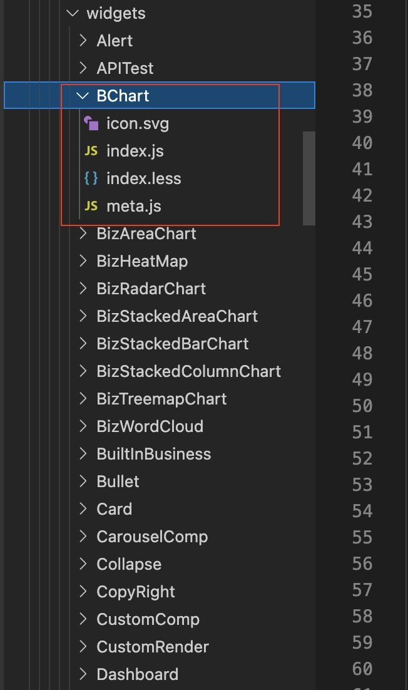
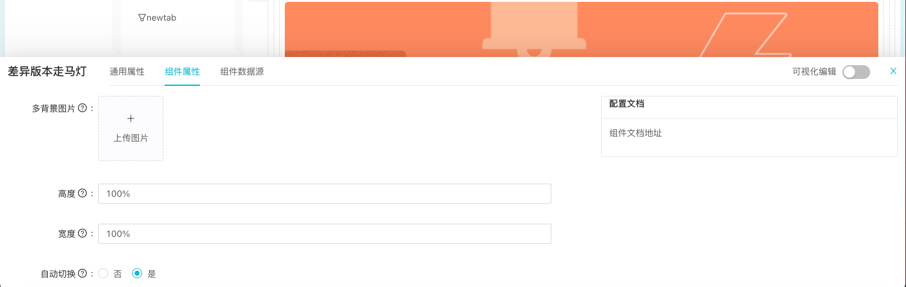

<a name="zwGUy"></a>

# 开发组件规范
- 样例说明



   - 组件必须包含一份主文件和一份meta.js, 如图TemplateComponents内index.js为组件主文件，meta.js是对该组件的名称、类型、自定义编辑属性、属性编辑表单类型、属性默认初始化值等的描述定义，index.svg是组件icon，目前组件icon的配置形式有两种：1 直接配置svg文件 ； 2 通过以iconfont的形式([https://www.iconfont.cn/manage/index?spm=a313x.7781069.1998910419.23&manage_type=myprojects&projectId=3290880](https://www.iconfont.cn/manage/index?spm=a313x.7781069.1998910419.23&manage_type=myprojects&projectId=3290880)),可申请加入项目，iconfont方便图标联动切换主题色
```js

ex port default {
  "id": "CarouselCompFive", 
  "type": "CarouselCompFive",//与导出打包组件一致
  "name": "CarouselCompFive",// 与导出打包组件一致
  "title": "差异版本走马灯", // 组件名称
  "info": {
    "author": {
      "name": "",
      "url": "",
    },
    "description": "走马灯，用于页面中部描述性说明",
    "links": [],
    "logos": {
      "large": "",
      "small": "",// 本地svg
      "fontClass":""// iconfont 优先级最高
    },
    "build": {
      "time": "",
      "repo": "",
      "branch": "",
      "hash": "",
    },
    "screenshots": [],
    "updated": "",
    "version": "",
    "docs": "<a target='_blank' href='https://3x.ant.design/components/alert-cn/'>组件文档地址</a>",
  },
  "state": "",
  "latestVersion": "1.0",
  "configSchema": {
    "defaults": {
      "type": "CarouselCompFive",
      "config": {
        "message": "动态专题介绍组件",
        "showIcon": false,
        "alertType": "success",
        "closable": false,
        "closeText": "关闭",
        "icon":"",
        "description": "动态专题介绍组件",
      },
    },
    "schema": {
      "type": "object",
      "properties": { // 对组件进行自定义属性的可编辑项
        "backgroundImgList": {
          "description": "多背景图片,每次可上传多张，上传操作为覆盖更新操作,增删操作即:重新上传", // 属性tooltip说明
          "title": "多背景图片", // 属性名称，见于表单label
          "required": false,
          "type": "string",
          "x-component": "IMAGE_UPLOAD_MULTI", // 目标属性的编辑表单类型，在docs文件夹有目前支持的全部类型，可根据需求便宜选取
          "initValue": "",
        },
        "carouselHeight": {
          "description": "高度,百分比或者数字,如 30%,200,",
          "title": "高度",
          "required": false, // 是否必填
          "type": "string",
          "initValue":'100%', // 目标属性初始化默认值
          "x-component": "Input",
        },
        "carouselWidth": {
          "description": "宽度，百分比或者数字,如 100%,200",
          "title": "宽度",
          "required": false, 
          "initValue":'100%',
          "type": "string",
          "x-component": "Input",
        },
        "autoPlay": {
          "description": "是否自动切换",
          "title": "自动切换",
          "required": false,
          "type": "string",
          "initValue":true,
          "x-component": "Radio",
          "x-component-props": {
            "options": [{"value": false, "label": "否"}, {"value": true, "label": "是"}],
          },
        },
        "dots": {
          "description": "是否展示指示点",
          "title": "是否展示指示点",
          "required": false,
          "initValue":true,
          "x-component": "Radio",
          "x-component-props": {
            "options": [{"value": false, "label": "否"}, {"value": true, "label": "是"}],
          },
        },
        "dotPosition": {
          "description": "指示点位置",
          "title": "指示点位置",
          "required": false,
          "type": "string",
          "x-component": "Select",
          "x-component-props": {
            "options": [{"value": "top", "label": "top"}, {"value": "bottom", "label": "bottom"},
                         {"value": "left", "label": "left"},{"value": "right", "label": "right"}],
                         },
                         },
                         "links": {
                         "description": "图片超链接，添加顺序同图片顺序",
                         "title": "图片超链接",
                         "required": false,
                         "type": "string",
                         "x-component": "HANDLE_TAG",
                         },
                         "easing": {
                         "description": "动画效果",
                         "title": "动画效果",
                         "required": false,
                         "type": "string",
                         "initValue":"linear",
                         "x-component": "Input",
                         },
                         "effect": {
                         "description": "动画效果函数",
                         "title": "动画效果函数",
                         "required": false,
                         "type": "string",
                         "x-component": "Select",
                         "x-component-props": { // seclect类型的待选项设置形式
                         "options": [{"value": "scrollx", "label": "scrollx"}, {"value": "fade", "label": "fade"}],
                         },
                         }
                         },
                         },
                         "supportItemToolbar":false, 
                         "dataMock": {},
                         },
                         "catgory": "remote",  // 用于组件列表的分类，默认值不变”remote“,代表远程组件
                         };
```

meta.js集成到基座的实际效果<br />

   - 应用基座注入组件的可用数据
```js

ex port default {
  widgetData: {}, // 组件已配备数据源，通过统一的数据源采集器获得的数据，可以是object，array,number,string等类型
  widgetConfig: {}, // 对应各组件定义的meta可配置属性字段，编辑后得到的属性value，供组件个性化渲染使用
  pageModel: {
    appId: 'testApp',//应用id
    nodeTypePath: 'testApp|app|T:pwIf7D9PC',//节点path
  },
  currentUser: {
    loginName: 'admin',//登录名
    lang: "zh_CN",//国际化语言类型
    nickname: "管理员",
    roles: [],// 角色
    userId: "empid::999999999",
    avatar: '',// 头像
  },
  nodeParams: {
    app_id: "testView2",
  },//节点参数阈，appId，数据源数据，过滤器字段等运行时参数字段都可以在nodeParams获取
}
```
widget组件库可提供COMPONENTS_PROPS.js包含组件集成到工程基座时的可用数据如上图，当前信息作为组件defaultProps使用，组件集成到基座时会被实际的应用信息覆盖

